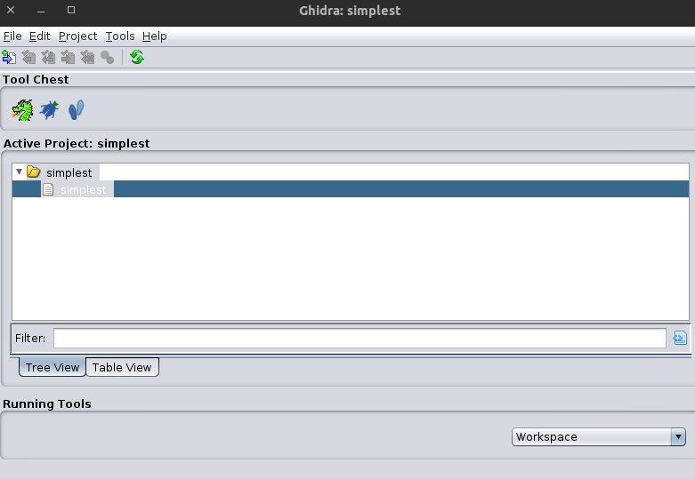
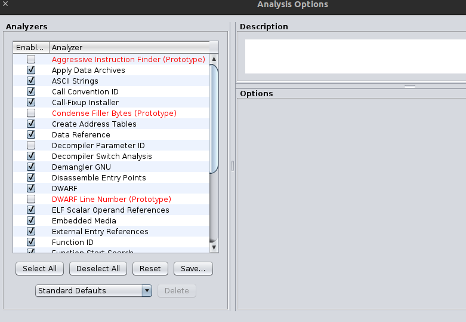
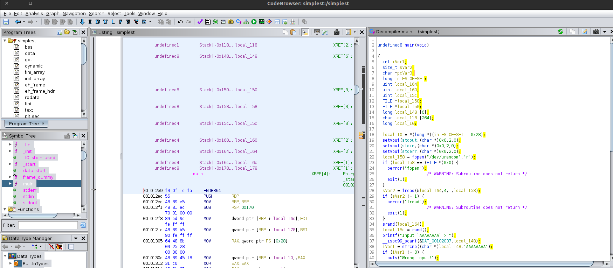
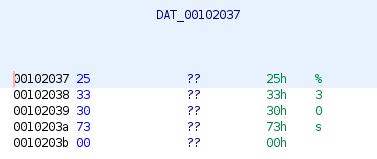
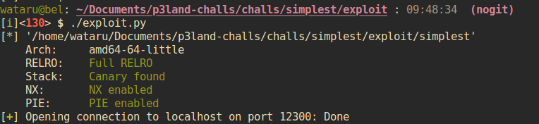
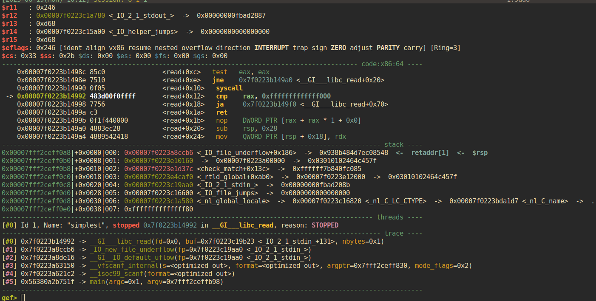
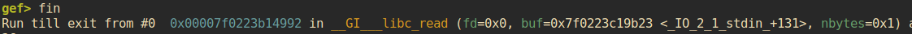

本ページでは、とても簡単な問題の通してバイナリ解析やexploitの入門を行います。
本ページの内容は以下のとおりです:

- [Ghidra](https://ghidra-sre.org/)を用いたバイナリ解析
- GDBを用いたデバッグ
- [pwntools](https://github.com/Gallopsled/pwntools)を使ったExploit
- リモートサーバへの攻撃とflagの奪取

## Challengeのダウンロード

このリンクからChallengeをダウンロードします: [DOWNLOAD](https://r2.p3land.smallkirby.com/simplest-236eb507c328828fe02fcb765b0c752950f1013b96743b5aefb057ac873ebe10.tar.gz).

ダウンロード後、以下のコマンドでファイルを展開してください:

```extract.bash
tar xvf ./simplest-<SHA256>.tar.gz
```

また、リモートサーバに繋ぐことができるかどうかも以下のコマンドで確認してください:

```bash
nc sc.skb.pw 30009
```


CTF等では、運営が用意したファイルをダウンロードして実行することになります。
CTFをやっているような人間が全員倫理的でsafeな人間であることは保証できないため、知らない人から渡されたファイルはしっかり事前に確認してください。
本サイトに関しては、ファイル名にSHA256ハッシュを含めているため少なくとも改ざんされていないことは保証できます。
その上でそのファイルが安全であるかどうかは、@smallkirbyを信頼するかどうかに依存します。


## Ghidraを用いたバイナリの解析

### Ghidraに解析させる

本講義で扱うchallngeは全てソースコードを添付するため、バイナリ解析自体はあまりしません。
でも折角なのでここで少しGhidraに触ってみましょう。

まずはGhidraを開いて、`File > Import File`からダウンロードしたバイナリ`simplest`をインポートします。


趣味の悪いドラゴンのアイコンをクリックすると、プロジェクトが開きます。バイナリを解析しますか？的なプロンプトが表示されるため、`Analyze`を押してください。


画面左の`Symbol Trees`から`main`を選択すると、main関数の逆アセンブリが表示されます。


### main関数の解読

1つずつmain関数を読んでいきましょう。

```c
  local_10 = *(long *)(in_FS_OFFSET + 0x28);
  setvbuf(stdout,(char *)0x0,2,0);
  setvbuf(stdin,(char *)0x0,2,0);
  setvbuf(stderr,(char *)0x0,2,0);

  local_158 = fopen("/dev/urandom","r");
  if (local_158 == (FILE *)0x0) {
    perror("fopen");
                    /* WARNING: Subroutine does not return */
    exit(1);
  }
  sVar2 = fread(&local_164,4,1,local_158);
  if (sVar2 != 1) {
    perror("fread");
                    /* WARNING: Subroutine does not return */
    exit(1);
  }
  srand(local_164);
  local_15c = rand();
```

最初の`setvbuf`はpwn問題のおまじないみたいなもので、入出力のバッファリングを無効化してくれます。

続く`fopen`では`/dev/urandom`をRモードで開いて、失敗したら`perror > exit`していますね。テンプレです。
その後、`fread`で`local_164`に対して4byteだけ`/dev/urandom`から読んでいますね。

Ghidraはデコンパイル時に、一定の規則名に従って変数名をつけてくれます。
`local_164`などは、スタックの高さ`164`にある変数名です。
Ghidraでは、デコンパイル画面で変数名を`Rename Variable`を選択すると変数名を変更することができます。
デフォルトの名前はとても読みにくいので、適宜変数名を変更することをおすすめします。


`urandom`から読み込んだ値を使って`srand`をして、`rand()`の返り値を`local_15c`に代入しています。これは`rand()`で乱数を取得する際の常套手段です。

```c
  long local_148 [6];

  printf("Input `AAAAAAAA` > ");
  __isoc99_scanf(&DAT_00102037,local_148);
  iVar1 = strcmp((char *)local_148,"AAAAAAAA");
  if (iVar1 != 0) {
    puts("Wrong input!");
                    /* WARNING: Subroutine does not return */
    exit(1);
  }
```

次に、`scanf`で`local_148`に対して文字列を読み込んでいます。`DAT_00102037`は`%30s`文字列です。



その後、`strcmp`で入力文字列が`AAAAAAAA`かどうかをチェックしています。異なる場合には`exit`していますね。

```c
  printf("Input integer: 0x%X without prefix > ",(ulong)local_15c);
  __isoc99_scanf(&DAT_0010207e,&local_160);
  if (local_15c != local_160) {
    puts("Wrong input!");
                    /* WARNING: Subroutine does not return */
    exit(1);
  }
```

次も同じような感じです。先程生成した乱数`local_15c`を表示して、ユーザの入力が乱数と一致するかどうかを確認しています。

```c
  memset(local_148,0,0x30);
  printf("Input `0x12345678UL` in little-endian > ");
  __isoc99_scanf(&DAT_00102037,local_148);
  if (local_148[0] != 0x12345678) {
    puts("Wrong input!");
                    /* WARNING: Subroutine does not return */
    exit(1);
  }
```

最後のプロンプトです。最初にバッファとして使っていた`local_148`をクリアしています。そのあと、`0x12345678UL`をリトルエンディアンで入力するように促し、入力が正しいかをチェックしています。

Ghidraのデコンパイル時の変数型推測はベストエフォートです。
実は上の例において、`long local_148[6]`はソースコードでは`char buf[0x30]`と定義されています。
しかし、ソースコード中で`*(unsigned long*)buf`としてアクセスする箇所があるため、Ghidraくんはこの型を`long`とした方が都合が良いと解釈したみたいです。


```c
  }
  local_150 = fopen("flag","r");
  if (local_150 == (FILE *)0x0) {
    perror("fopen");
                    /* WARNING: Subroutine does not return */
    exit(1);
  }
  pcVar3 = fgets(local_118,0x100,local_150);
  if (pcVar3 == (char *)0x0) {
    perror("fgets");
                    /* WARNING: Subroutine does not return */
    exit(1);
  }
```

最後に、`flag`をRモードで読み込んで出力しています。ここまでプログラムの実行が到達するとフラグが得られるみたいですね！

```c
  if (local_10 != *(long *)(in_FS_OFFSET + 0x28)) {
                    /* WARNING: Subroutine does not return */
    __stack_chk_fail();
  }
```

こいつは関数から返る時のお決まりみたいなもので、スタック上のカナリアを見てしてスタックが壊れていないかどうかをチェックしています。

## pwntoolsを用いたExpoloit

### ローカルサーバを建てる

さて、ここまででバイナリの解析は終わりました。入門プログラムなので、簡単な入力を3回するだけでフラグが貰えるようです。
ここからはpwntoolsを用いてローカルでExploitを書いていきます。

まずはローカルサーバでchallengeを動かしましょう。以下のスクリプトを`socat`という名前で保存し、実行します。

```socat.bash
socat -v tcp-listen:12300,fork,reuseaddr exec:./simplest
```

これを実行するとローカルホストのポート12300でchallengeサーバが起動するため、`nc`で接続してみましょう。

```nc.bash
nc localhost 12300
```

無事に接続できたらOKです。

### pwntools template

pwntoolsを用いたexploitのテンプレートは以下のようになります:

```exploit.py
#!/usr/bin/python3
#encoding: utf-8;

from pwn import *
import sys

################################################
FILENAME = "simplest" # EDIT HERE
LIBCNAME = "" # EDIT HERE
hosts = ("", "localhost", "localhost") # EDIT HERE
ports = (0, 12300, 23947) # EDIT HERE
################################################

rhp1 = {'host': hosts[0], 'port': ports[0]}  # for actual server
rhp2 = {'host': hosts[1], 'port': ports[1]}  # for localhost
rhp3 = {'host': hosts[2], 'port': ports[2]}  # for localhost running on docker
context(os='linux', arch='amd64')
binf = ELF(FILENAME)
libc = ELF(LIBCNAME) if LIBCNAME != "" else None

def exploit():
    global c

## main ##############################################
if __name__ == "__main__":
    global c

    if len(sys.argv) > 1:
        if sys.argv[1][0] == "d":
            cmd = """
          set follow-fork-mode parent
        """
            c = gdb.debug(FILENAME, cmd)
        elif sys.argv[1][0] == "r":
            c = remote(rhp1["host"], rhp1["port"])
            #s = ssh('<USER>', '<HOST>', password='<PASSOWRD>')
            #c = s.process(executable='<BIN>')
        elif sys.argv[1][0] == "v":
            c = remote(rhp3["host"], rhp3["port"])
    else:
        c = remote(rhp2['host'], rhp2['port'])
    exploit()
    c.interactive()
```

以下、exploitコードは`exploit()`関数の中身だけを抜粋して書いていきます。

ひとまず本コードを`exploit.py`という名前で保存してください。
その後、`EDIT HERE`と書いてある部分を適宜修正します。
`chmod +x ./exploit.py && ./exploit.py`で実行してみましょう。以下のような画面が出力されればサーバとの接続に成功し、exploitの準備ができています。



### プロンプト1: 出力を待って文字列を入力

最初のプロンプトは`Input 'AAAAAAAA' > `でした。先程バイナリを読んだ通り、この文字列を入力すれば次のプロンプトに進めます。

pwntoolsでは、`recvuntil()`メソッドで特定の文字列が出力されるまで出力を消費することができます。
また、`sendline()`メソッドで任意バイトを改行付きで出力することができます。

なお、`sendline`メソッドは`byte`型を受け付けますが、Python3では文字列をバイトにするために`b`を付ける必要があることに注意してください。`ptrlib`を使うと、そのへんをいい感じにラップしてくれるらしいです。

```py
    c.recvuntil("> ")
    c.sendline(b"AAAAAAAA")
```

### プロンプト2: 出力をパースして入力

続くプロンプトは最初に生成した乱数を`0x%X`フォーマットで出力し、10進文字列として入力させるものでした。

まずは`recvuntil()`メソッドで乱数の手前まで出力を消費します。その後、`recvuntil(" ")`で乱数を読みます。`" "`は、乱数の終わりを識別するためのトークンで、`[:-1]`とすることで消去します。読み込んだ出力はあくまでも文字列なので、`int()`メソッドで文字列に変換します。最後に、`sendline()`で10進文字列として入力を与えます。先ほどと同様、`sendline()`の引数は`byte`型である必要があることに注意しましょう。

```py
    c.recvuntil("Input integer: ")
    rand = int(c.recvuntil(" ")[:-1], 16)
    c.recvuntil("> ")
    print("rand: ", hex(rand))
    c.sendline(str(rand).encode())
```

### プロンプト3: エンディアンに注意

最後のプロンプトは、`0x12345678`という整数値をリトルエンディアンで出力するというものでした。
pwntoolsでは、`context(os='linux', arch='amd64')`とすることでアーキテクチャを指定できます。
`amd64`を指定した場合には各種メソッドが整数値をリトルエンディアンとしてエンコードしてくれるようになります。
この設定の後に、`p64`メソッドを使うことで整数を64bit整数型としてエンコードすることができます。

```py
    c.recvuntil("> ")
    c.sendline(p64(0x12345678))
```

### Local Exploit

ここまででexploitが作成できました。実際にローカルで動かしてみましょう。

```bash
./exploit.py
```

ローカルに`flag`ファイルを置いていない場合には、`socat`を動かしているターミナルに`can't open file`のような表示が出るはずです。これが出力されればOKです！


## GDBでデバッグ

この問題では特にGDBを使うまでもありませんが、せっかくなので使っておきましょう。
今回は3つ目のプロンプトに対してexploitで入力を与えた直後をデバッグしたいと想定します。

まず、exploit側のデバッグしたい箇所に`input()`を入れて実行を一時停止します:

```py
    c.recvuntil("> ")
    input("WAITING")
    c.sendline(p64(0x12345678))
```

exploitを行うと、`WAITING`と表示された後に実行が止まります。これが表示されたら、`ps`コマンドを用いて`simplest`プロセスを探します:

```bash
$ ps -ax | grep simplest
 129883 pts/20   S+     0:00 ./simplest
```

続いて、開いてPID 129883のプロセスにアタッチします。

```bash
gef ./simplest
gef> att 129883
```

pwndbgやgefを利用している場合には以下のようなイカつい画面が出ます:



スタックトレース(`bt`コマンド)から分かるように、現在は`scanf`の途中で実行を止めています。まずは`main`関数に戻りたいため、`fin`コマンドを実行します。`fin`は現在の関数から抜けるまで実行を進めてくれます。`fin`の実行後、GDBが以下の表示をして止まります:



これは先程`input()`でexploitの実行を止めたためです。exploitをしているターミナルでEnterを押して実行を再開させましょう。`main`まで戻ってくると、続く命令は以下のようになります:

```
    0x000056380a2b751a e8b1fcffff         <main+0x231>   call   0x56380a2b71d0 <__isoc99_scanf@plt>
    0x000056380a2b751f 488d85c0feffff     <main+0x236>   lea    rax, [rbp - 0x140]
 -> 0x000056380a2b7526 488b00             <main+0x23d>   mov    rax, QWORD PTR [rax]
```

Ghidraで見た感じだと、入力が`0x12345678`と比べるはずです。そのため、`lea rax, [rbp - 0x140]`の`rbp - 0x140`こそがユーザ入力が格納されるアドレスであることが分かります。このアドレスに何が入っているかを見てみましょう。
GDBでは`x/<num><format>`コマンドでメモリをダンプすることができます。

| param | 説明 |
| --- | --- |
| `<num>` | 何個分表示するか |
| `<format>` | 表示フォーマット。`b`/`h`/`w`/`g`でバイト/ハーフワード/ワード/ダブルワード。`s`で文字列。`i`で命令。`x`で16進数。 |

まずは`x/16bx $rbp - 0x140`で、`rbp - 0x140`から16bytes分を1byteずつ表示しましょう:

```
gef> x/16bx $rbp - 0x140
0x7fff2ceff940: 0x78    0x56    0x34    0x12    0x00    0x00    0x00    0x00
0x7fff2ceff948: 0x00    0x00    0x00    0x00    0x00    0x00    0x00    0x00
```

入力には`0x12345678`を入れたはずですが、上の表示では`0x78 0x56...`と逆順で入っています。
各CPUアーキテクチャはそれぞれ[エンディアン](https://ja.wikipedia.org/wiki/%E3%82%A8%E3%83%B3%E3%83%87%E3%82%A3%E3%82%A2%E3%83%B3)というメモリ上のデータ配置に関する決まりを持っています。
x64は**リトルエンディアン**のため、8byte整数値は上記のように逆順で入れられることになります。

なお、GDBの`x`コマンドはエンディアンをいい感じに解釈して出力してくれます。例として、`x/2gx`で2QWORD文を表示してみると以下のように`0x12345678`が表示されることが分かります。

```
gef> x/2gx $rbp - 0x140
0x7fff2ceff940: 0x0000000012345678      0x0000000000000000
```

## リモートサーバへの攻撃

さて、ローカルでexploitが動いたので実際にリモートサーバに攻撃してみましょう。

上記のテンプレートを利用している場合には、`hosts / ports`をリモートサーバのものに変更したあと、以下のように`r`を引数に渡して実行するとリモートサーバに繋げることができます:

```py
hosts = ("sc.skb.pw", "localhost", "localhost") # EDIT HERE
ports = (30009, 12300, 23947) # EDIT HERE
```

```bash
./exploit.py r
```
